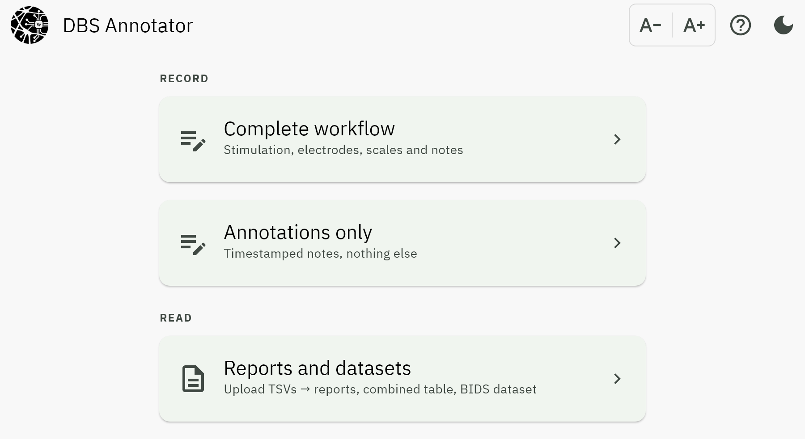

DBS Annotator
=============

|

**Record deep brain stimulation programming visits, and get analysis-ready data
out.**

Once the electrodes are implanted, the patient comes back to see a neurologist or
psychiatrist, who tries stimulation configurations and settles on one that works.
That takes a visit or several, and the parameters go on being adapted over months
or years.

DBS Annotator documents those visits: the stimulation parameters tried on each
contact, the clinical and session scale ratings at every configuration, side
effects, and free-text notes, written to :doc:`BIDS tab-separated files
<output_format>` that go straight into analysis. It also produces
clinician-readable :doc:`PDF and Word reports <reports>` for the patient
record.

It runs **fully offline**: no account, no server, no telemetry. Tablet-first for
iPadOS and Android, with desktop builds for Linux, Windows and macOS.

.. note::

   This is research software. It documents what was recorded; it does not
   recommend stimulation settings. See :ref:`what-the-reports-do-not-say`.

At a glance
-----------

.. list-table::
   :header-rows: 1
   :widths: 30 70

   * - Aspect
     - Detail
   * - Platforms
     - iPadOS, Android, Linux, Windows, macOS, from one codebase
   * - Data format
     - BIDS ``_beh.tsv`` with a JSON sidecar, one row per (block, scale)
   * - Reports
     - PDF and Word, both built from the same numbers
   * - Connectivity
     - None required, ever
   * - Licence
     - MIT

.. toctree::
   :maxdepth: 2
   :caption: Getting started

   overview
   installation
   quickstart

.. toctree::
   :maxdepth: 2
   :caption: Screens

   screens/home
   screens/complete_workflow
   screens/annotations
   screens/reports
   screens/dialogs

.. toctree::
   :maxdepth: 2
   :caption: Outputs

   reports
   output_format

.. toctree::
   :maxdepth: 2
   :caption: Reference

   faq
   privacy

Release notes are published with each tagged release on
`GitHub <https://github.com/neuromodulation/DBSAnnotator/releases>`_.
