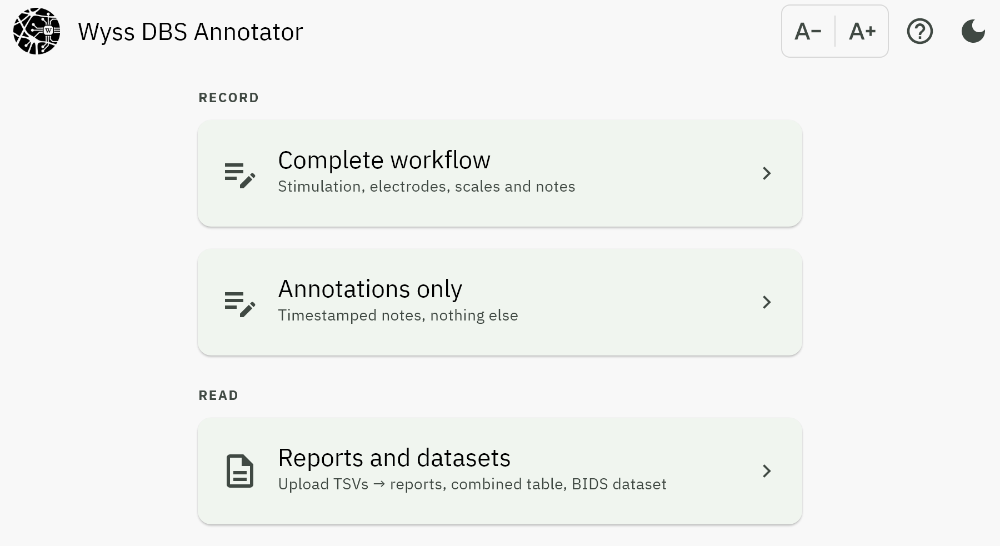

Quick start
===========

Opening the app
---------------

Launch Wyss DBS Annotator as you would any other app on the device. The home screen
offers three entries, in two groups: **Record** is for a session happening now;
**Read** is for files that already exist.

.. list-table::
   :header-rows: 1
   :widths: 26 74

   * - Entry
     - Use it when
   * - :doc:`Complete workflow <screens/complete_workflow>`
     - You are running a programming session: stimulation parameters, electrode
       contacts, scale ratings, side effects and notes.
   * - :doc:`Annotations only <screens/annotations>`
     - You only want timestamped notes, with no stimulation data.
   * - :doc:`Reports and datasets <screens/reports>`
     - You have one or more TSVs and want reports, a combined table or a BIDS
       dataset, with no authoring.

The first two *create* data. The last only *reads* it, so it is safe to open
against a file you care about.

New to the vocabulary (block, baseline, clinical and session scales, BIDS)? See
:doc:`glossary`.

The theme and text-size controls in the top bar are on every screen; see
:doc:`screens/home`.

Your first session
------------------

The shortest useful path through
:doc:`Complete workflow <screens/complete_workflow>`:

1. **File.** Enter the patient ID and run number, then choose where to save.
   The app builds the BIDS filename for you and writes the file immediately, so
   there is somewhere for entries to land from the first insert onward.

2. **Initial configuration.** Record the state the patient arrived in: the
   electrode model, the settings currently programmed, and the baseline clinical
   scores. Insert it. This block is marked as the baseline and is excluded from
   "configurations tested" later.

3. **Session scales configuration.** Name the scales you will rate at every
   configuration, with their range. Disease presets fill this in with a tap.

4. **Recording.** For each configuration: set the parameters, select contacts on
   the lead diagram, rate the scales, add any side effect, and insert. Repeat.

Things worth knowing early
--------------------------

**Every insert is saved immediately.** There is no separate save step. Each
entry is written to your file and to a working copy inside the app, so a crash
or a closed window loses nothing: the next time you open the workflow, the app
offers the unfinished session back.

**Notes and side effects belong to a block.** They are attached to the
configuration that was active when you typed them, not to the session as a
whole, which is what makes it possible afterwards to say *which* setting caused
the paraesthesia.

**Scale targets are yours to set.** If you want the app to highlight the
best-scoring configurations, you must first say what "better" means for each
scale: lower, higher, or closest to a value. Until you do, no configuration is
ranked. This is deliberate; see :ref:`what-the-reports-do-not-say`.

**Text size and theme** are adjustable from the top bar of every screen.

Getting the report
------------------

From the Recording step choose **Export** and pick PDF or Word. For a file
recorded earlier, upload it in :doc:`Reports and datasets <screens/reports>`
and choose *Single session report*. You will be asked which sections to
include and can set the scale targets at that point. See :doc:`reports`.
