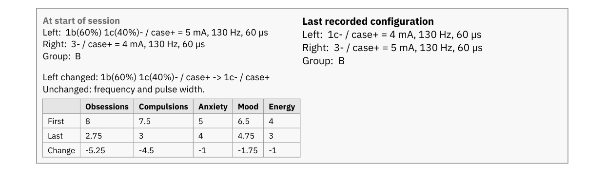
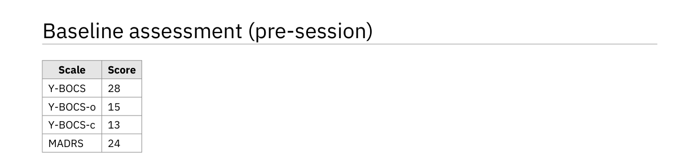
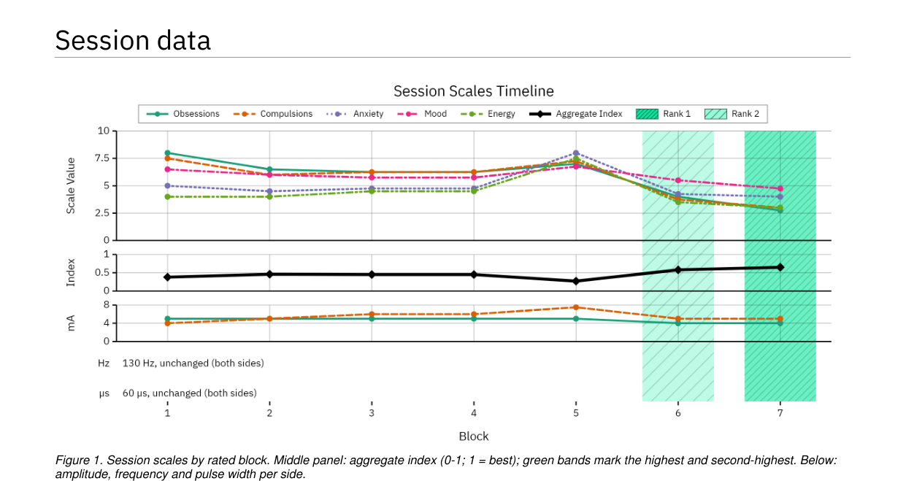
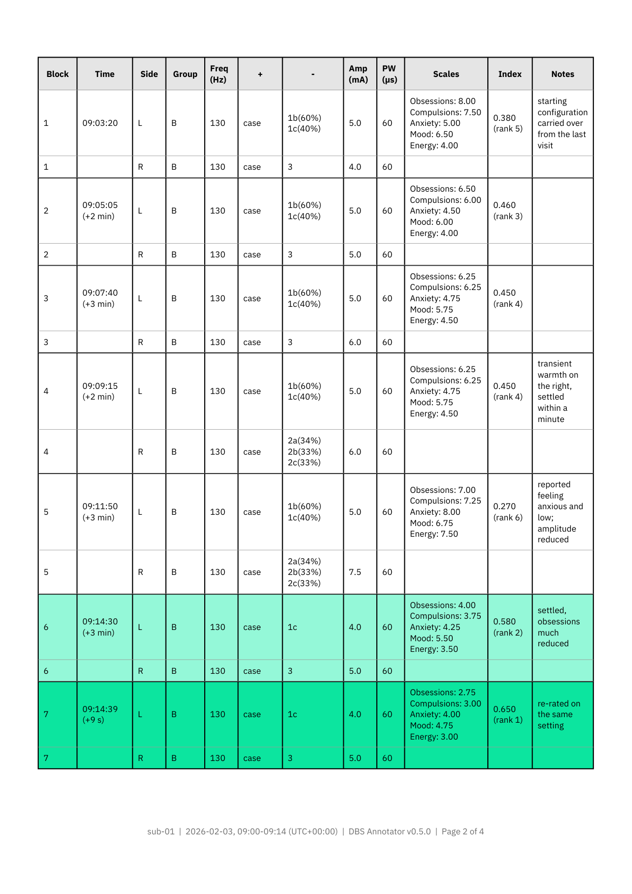
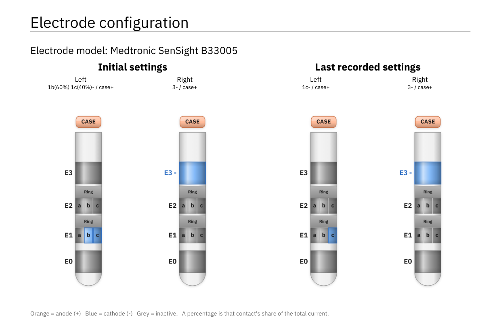
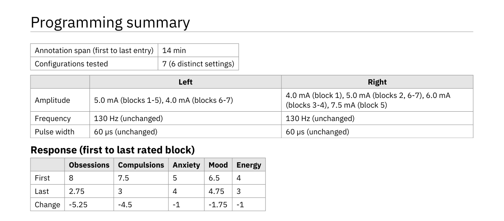
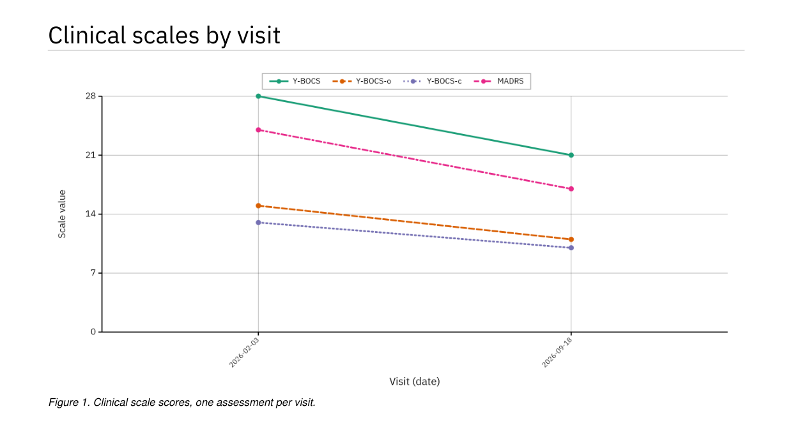
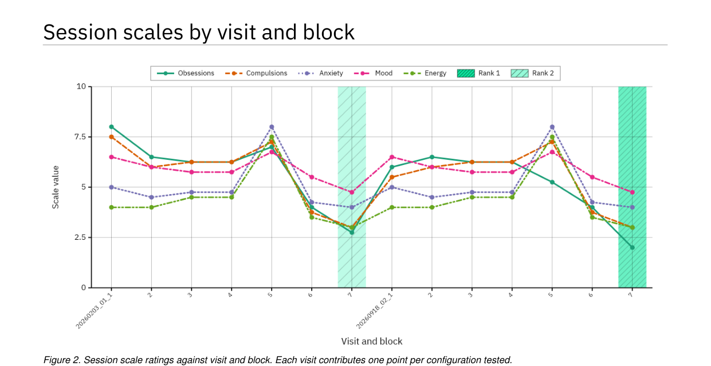
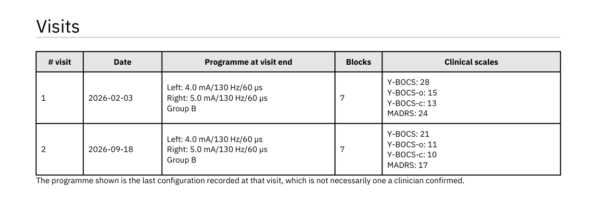
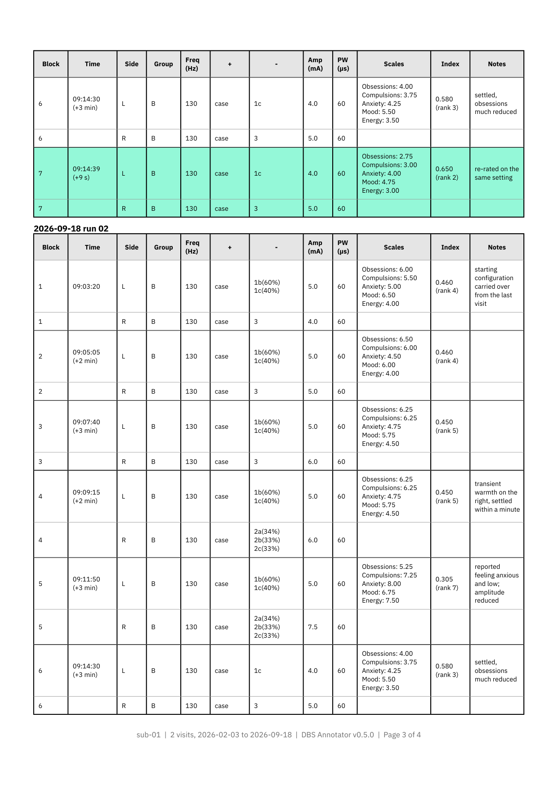

Reports
=======

Every workflow can produce a report in **PDF** and in **Word** (``.docx``). Both
are built from the same computed values, so the two documents cannot disagree
with each other, a property worth having when one is filed and the other is
edited.

Every image on this page is the real report, generated from the synthetic
example session shipped with the app.

Choosing what goes in
---------------------

Exporting asks which sections to include, and lets you set the
:ref:`scale targets <scale-targets>` at the same time. Paper size (A4 or Letter)
applies to both formats.

The patient header is always present, so a report is never anonymous.

Session report
--------------

Header and page-one box
~~~~~~~~~~~~~~~~~~~~~~~

The header gives the patient ID, the session date and clock span *taken from the
recorded rows* with their UTC offset, and separately the date the document was
generated, the app version, and the source filename with its row count. The
session date and the generation date are distinct fields on purpose: a report
produced a fortnight later must not assert that the session happened the day the
button was pressed.

Under it, a box with the first and the last settings per side in vendor notation:
contacts with their share of current, total milliamps, frequency, pulse width and
group. Then what changed between the two, and the response of each session scale
from the first to the last rated block, so the outcome of the visit sits next to
what was tried. The last settings are named for what they are, the last block in
the file. Nothing in the data records that a clinician *confirmed* them.

Baseline assessment
~~~~~~~~~~~~~~~~~~~

The clinical scores recorded before stimulation changes began, as a compact
two-column table.

Session data
~~~~~~~~~~~~

*The figure* has one block axis shared by stacked panels: the session scales, the
aggregate index on its own 0-1 axis, then the amplitude, frequency and pulse width
per side, as in the live view in the app. A parameter that never changed during
the session is stated in one line, such as "130 Hz, unchanged (both sides)",
rather than plotted flat. When targets are set, green bands mark the best and
second-best scoring settings through every panel.

*The table* gives one row per side per block: time, group, frequency, anode,
cathode with the per-contact current share, total amplitude, pulse width, the
scale ratings, the aggregate index with its rank, and notes. Values belonging to
the block are printed once, not repeated per side, and the line between a
block's two sides is light while the rule between blocks is heavy, so each block
reads as one configuration. With no targets set, nothing is ranked and the Index
column is left out rather than printed empty.

Under the table, the legend: what the green means, the targets, how many scales
were rated per block, how far repeat ratings of one setting differ, how the index
is computed, and the disclaimer. It is kept on one page, so the disclaimer is
never separated from the shading it qualifies.

Electrode configuration
~~~~~~~~~~~~~~~~~~~~~~~

The initial and last-recorded settings as two pairs of lead diagrams, Left and
Right of each close together, each captioned with its configuration in words,
plus a key for the polarity colours. The caption matters: the drawing shows
*which* contacts are active but not how current is shared, and for current
steering the split is the configuration.

Programming summary
~~~~~~~~~~~~~~~~~~~

Two short tables: the annotation span and the number of configurations tested,
then the amplitude, frequency and pulse width actually tried, one side per column.
Then the response: one column per scale, its first and last rated value and the
change between them. That is the clinical bottom line, and it cannot be recovered
from the parameter ranges alone, which is why the same table also sits in the
page-one box.

Attestation
~~~~~~~~~~~

Recorded by / Reviewed by / Date, over rules to sign on.

Longitudinal report
-------------------

Several sessions of one patient, compared across visits. See
:doc:`screens/reports` for the screen that produces it. However the files were
picked, visits are ordered by patient and then from the earliest to the most
recent, here, in the combined table and in the BIDS export.

If the imported files name more than one patient, the report says so in a box on
page one. Combining two people into one longitudinal report is a safety problem,
not a formatting one.

Clinical scales by visit
~~~~~~~~~~~~~~~~~~~~~~~~

One assessment per visit, so the x axis is the visit itself, labelled by its
date (with the run added only when two visits share a day). This is the "is the
patient better than last time" figure. Its axis starts at zero, since a clinical
total is a magnitude.

Session scales by visit and block
~~~~~~~~~~~~~~~~~~~~~~~~~~~~~~~~~

Several configurations per visit, so each visit contributes a run of points.
With scale targets set, green bands mark the two best configurations across all
visits together, and the axis is fixed to the declared range. Every visit's
index is computed against the same targets and declared ranges, which is what
makes one ranking across visits meaningful.

Visits
~~~~~~

The date, the programme in force at the end of that visit with Left and Right on
separate lines, the number of blocks, and every clinical scale recorded at that
visit, one per line. How each scale moved between visits is what the figure
above shows.

Session data per visit
~~~~~~~~~~~~~~~~~~~~~~

Each visit's table, under its own heading, laid out as in the session report. With
targets set, the same two configurations as in the figure are shaded green:
the highest and second-highest aggregate index across all visits.

Annotations report
------------------

A patient header, the notes in a time-and-text table oldest-first, the span they
cover, and an attestation block. See :doc:`screens/annotations`.

.. _scale-targets:

Scale targets
-------------

Ranking configurations requires knowing what "better" means for each scale, and
only you know that. Each scale gets a mode:

``Min``
   Lower is better, as for a symptom severity score.

``Max``
   Higher is better, as for a function or quality-of-life score.

``Custom``
   Closest to a stated value is better.

``Ignore``
   Excluded from the ranking.

The aggregate index is the unweighted mean, across the scales rated at that
block, of each value normalised into its declared range and oriented by its
target, clipped to 0-1, where 1 is best. A scale with no target contributes a
neutral 0.5 at half weight. The report prints this definition alongside the
figure, and prints the bounds each scale was normalised into, so the number can
be reproduced.

.. _what-the-reports-do-not-say:

What the reports do not say
---------------------------

The ranking is a computation over recorded scale values, and its limits are
worth stating here as plainly as the reports themselves state them.

**It does not account for side effects or tolerability.** A configuration that
scored well on every scale and produced an intolerable paraesthesia will be
ranked highly. The notes column is not an input.

**It is not a recommendation.** It does not say which settings to programme.

**It will not run without targets.** With no scale targets set, no configuration
is ranked, nothing is shaded green, and the report says so. Defaulting every
scale to "lower is better" would silently score *falling mood* and *falling
energy* as improvements, and inventing a clinical intention is worse than
declining to rank.

**"Last recorded configuration" is not "chosen".** It is the final block in the
file. A setting that was tried and rejected would appear there identically.

**The numbers carry no instrument metadata.** The record stores no scale anchors,
administration method or rater, so those cannot be reproduced from a report.

Where the session's own data allows it, the report also prints the spread between
repeat ratings of an unchanged setting, which measures how far the index moves
when nothing changes, so that two settings closer together than that can be seen
for what they are.
