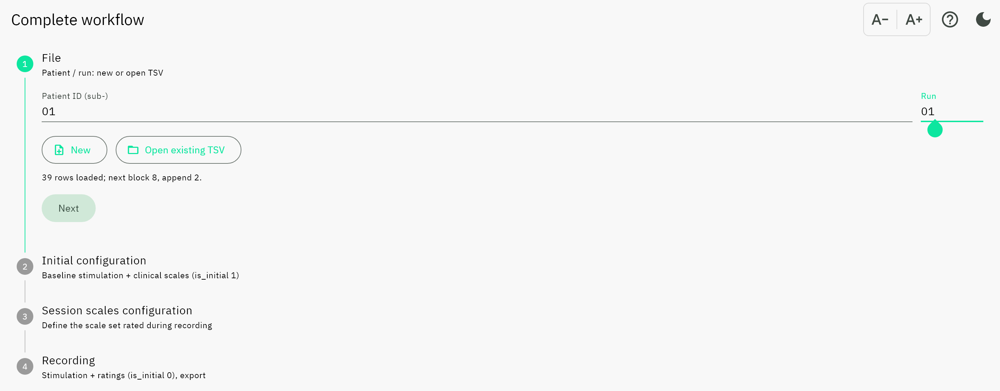
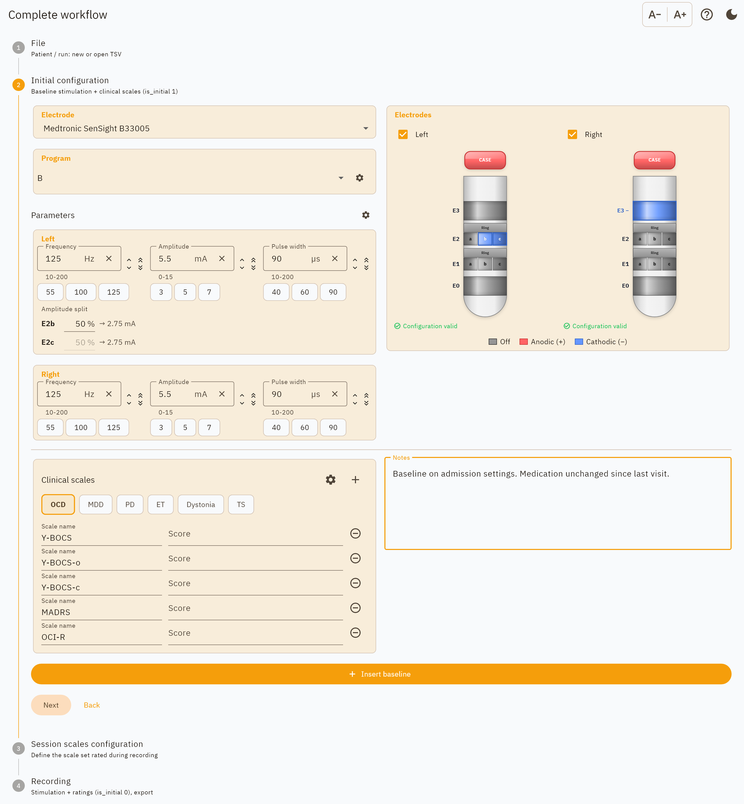
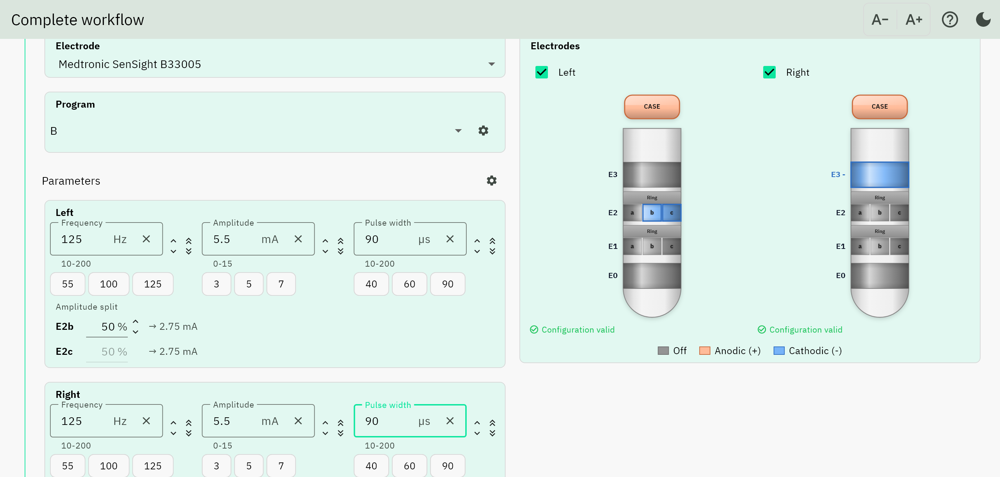
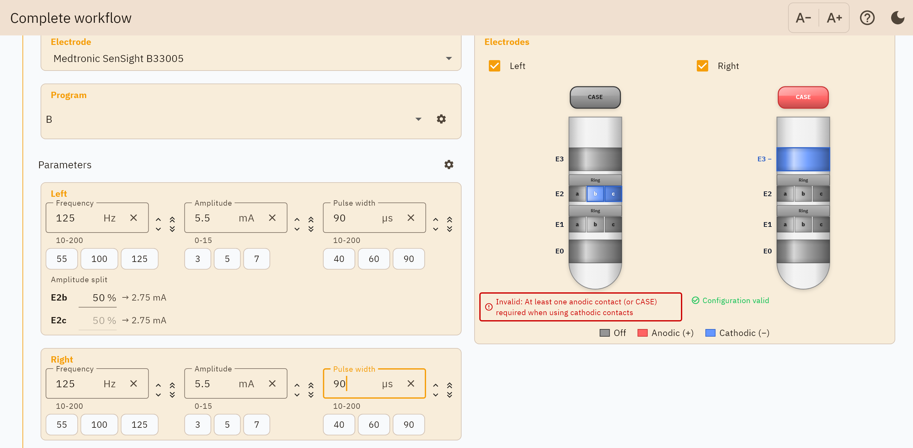
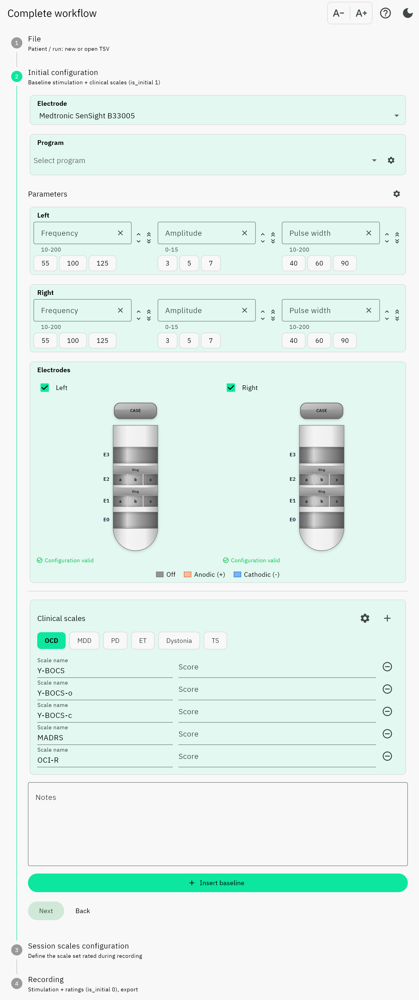
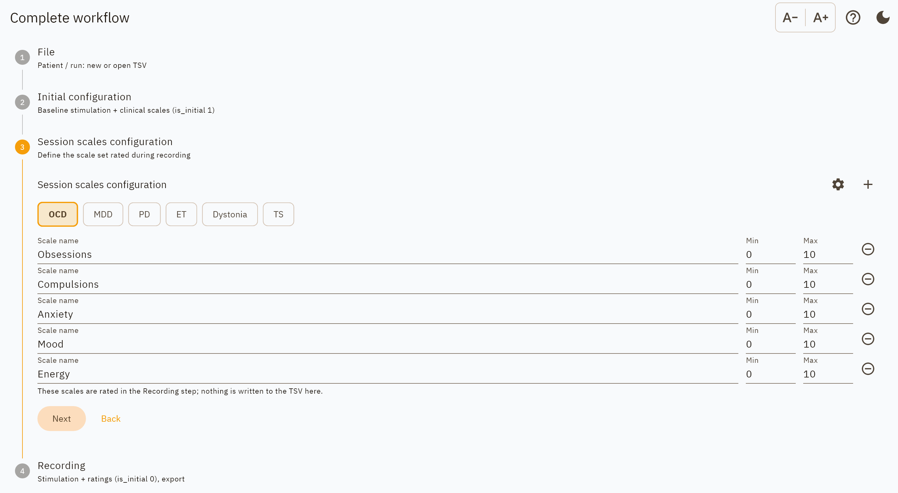
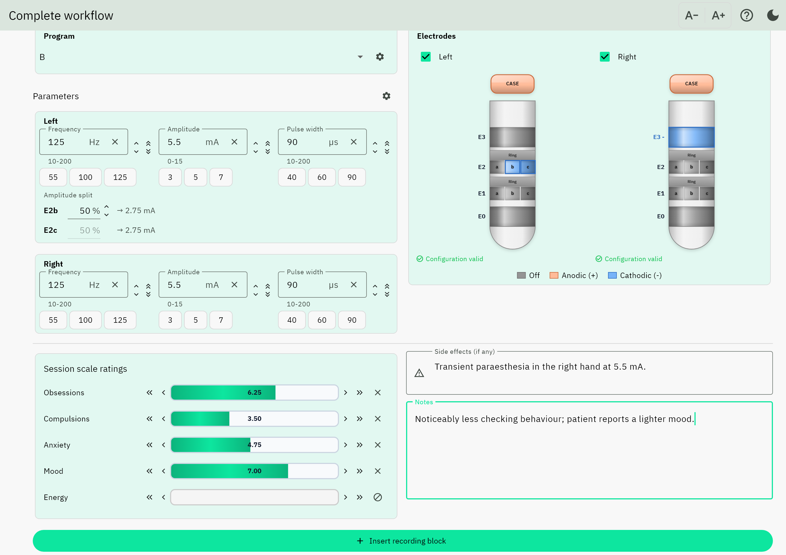
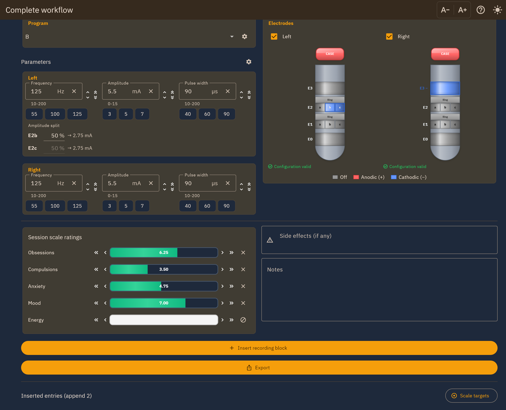
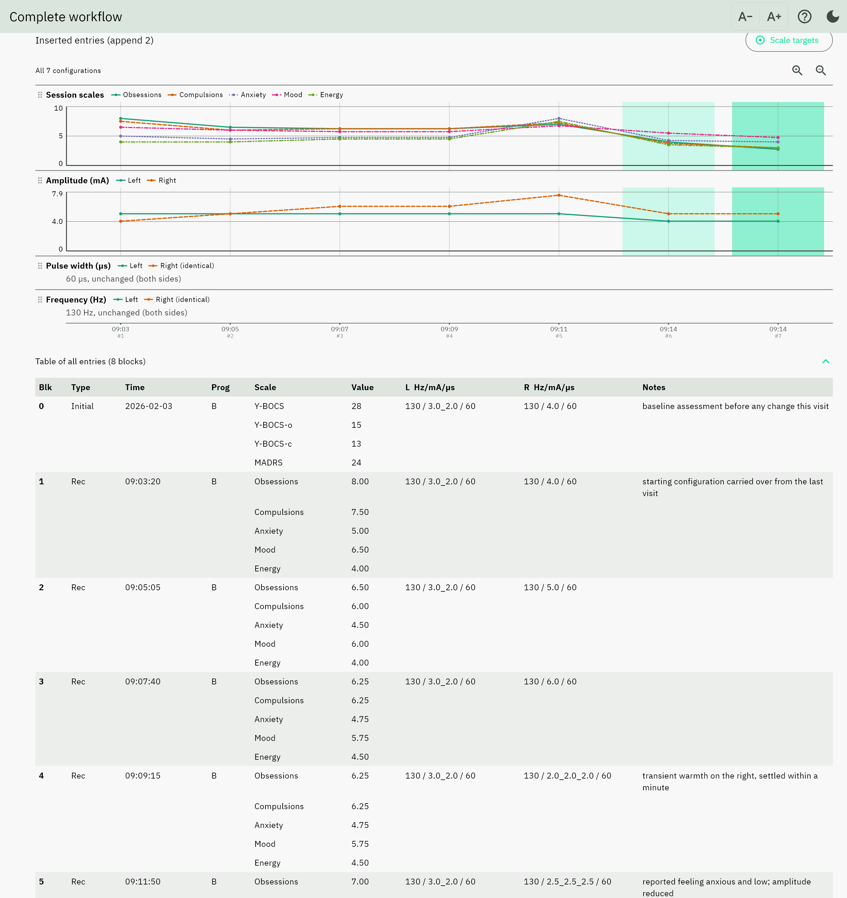
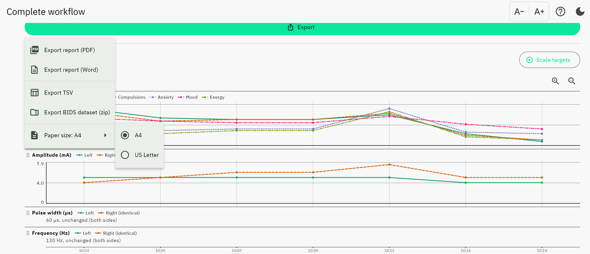

Complete workflow
=================

The full session: stimulation parameters, electrode configuration, scale ratings,
side effects and notes, recorded configuration by configuration.

The screen is a four-step wizard. Steps 1 and 3 share a two-row layout that
follows the order the work is actually done in: what was *delivered* on top
(parameters and electrodes), what was *observed* below (scales, side effects
and notes).

Step 0: File
------------

         reporting 39 rows loaded
   :width: 100%

   The File step, with an existing session opened.

Enter the **patient ID** and **run number**, then choose where to save. **New**
asks whether this visit is a loose TSV or goes straight into a BIDS dataset.

**A loose TSV** goes wherever you choose. The app composes the
:doc:`BIDS filename <../output_format>` and creates the file straight away,
along with its ``.json`` sidecar, so every later insert has somewhere to go.

**Into a dataset** asks for the dataset folder and for the session label,
proposed as today's date but editable: ``ses-YYYYMMDD`` is this app's
convention, and plenty of studies use ``ses-preop`` or ``ses-3mo``. The visit is
filed at its BIDS path when the **first block is inserted**, not when the file
is created: a dataset holding a header-only TSV that no ``scans.tsv`` lists is
one that does not validate, and before the first block there is nothing to file.
From then on every insert rewrites it in place, and the dataset index files stay
consistent. It goes through the same rules as
:ref:`adding to a dataset <dataset-merge-rules>`, so your
``dataset_description.json`` and ``participants.tsv`` columns are safe, and a
visit already filed there is refused rather than overwritten. Desktop only:
iPadOS and Android cannot give an app a writable folder, so only the loose file
is offered there.

Whichever you choose, **every entry is also written to a working copy inside the
app** as you record, so a crash or a closed window loses nothing. The app offers
that copy back the next time you open this workflow.

*Open* loads an existing session instead, and appends to it. The status line
under the buttons reports what was found: the row count, and the block and
``append_id`` the next insert will carry, so an append is never a guess. Opening a
file also adopts the **electrode model named in that file**, so the lead diagrams
show the patient's actual hardware rather than whatever the dropdown last held.
If the file names a model that is not in the catalogue, the app says so rather
than drawing the wrong lead.

A file that is not a programming session, an annotations file for instance, is
refused with an explanation rather than loading as empty rows.

Step 1: Initial configuration
-----------------------------

The state the patient arrived in, before anything is changed.

         and amplitude split on the left, lead diagrams on the right, clinical
         scales and notes below
   :width: 100%

   Step 1 with a baseline configuration entered: current steered across two
   segments of level 2 on the left lead, and the OCD clinical scale set.

**Electrode model.** Choose the implanted lead. The catalogue covers Medtronic,
Boston Scientific, Abbott, PINS and ALEVA leads, including segmented
(directional) models. The diagrams are drawn to each lead's real contact heights
and spacings, so two different leads look different.

**Parameters, per side.** Frequency, amplitude and pulse width, with quick-pick
presets. When more than one cathode is active, an amplitude split appears so you
can set the percentage per contact. Those are the ``E2b`` and ``E2c`` rows in
the screenshot above, each showing the milliamps its share works out to.

**Clinical scales.** The baseline assessment: disease-specific scores such as
Y-BOCS or UPDRS-III. Disease presets fill the list in with a tap.

**Notes.** Free text. Unlike the recording step, these persist after inserting,
so you can keep refining the baseline description.

Inserting records this as the **baseline block** (``is_initial = 1``).

Selecting contacts
~~~~~~~~~~~~~~~~~~

Tap a contact to cycle it from off, to anode, to cathode, and back to off. Tap
the case to use it as the return. Segmented levels show their three segments
plus a *Ring* strip that activates the whole level at once.

         "Configuration valid" in green, above the polarity key
   :width: 100%

   A valid configuration: two segments of level 2 as cathodes on the left, a
   ring contact on the right, the case as the return on both.

Invalid combinations are applied anyway and flagged as you build them, so you can
work through a configuration in whatever order suits you rather than having edits
rejected mid-way:

         return path
   :width: 100%

   The same cathodes with no return path selected. The change is kept; the pane
   says why it will not stimulate.

Narrow screens
~~~~~~~~~~~~~~

Below about 900 logical pixels (a phone, or a tablet held in portrait) the two
rows stack into one column. Everything is present; there is simply more
scrolling.

   Step 1 in the single-column layout.

Step 2: Session scales configuration
------------------------------------

         scale with a name, minimum and maximum
   :width: 100%

   The scale set that will be rated at every configuration.

Name the scales to be rated at *every* configuration, with a minimum and maximum
for each. Keeping the set fixed for the whole session is what makes the ratings
comparable between configurations.

Choosing a disease preset here, or having chosen one in step 1, fills the list.
The gear icon edits :ref:`the presets themselves <dialog-session-scales>`, which
persist between sessions. Nothing on this step is written to the file; it defines
what step 3 will ask for.

Step 3: Recording
-----------------

The loop, repeated once per configuration tried.

         ratings, side effects and notes below, with the Insert button
   :width: 100%

   One configuration rated and ready to insert. *Energy* is marked not assessed.

Set the parameters and contacts as in step 1, then rate each scale. A scale that
was not assessed can be marked omitted, which writes ``n/a`` rather than a
made-up number. That is the grey bar with the crossed-out icon in the
screenshot above.

**Side effects** have their own field, separate from notes, because a side effect
is the tolerability record for that configuration and should not be buried in
free text.

Insert to record the block. Notes and side effects clear, ready for the next one;
the parameters stay, so a single amplitude change is one edit rather than a full
re-entry.

The same step in the dark theme:

   Dark theme. The contact polarity colours are deliberately identical in both
   themes, because they are the safety-relevant part of the drawing.

Reviewing as you go
~~~~~~~~~~~~~~~~~~~

Below the entry area, everything inserted so far is shown two ways.

         pulse width and frequency, with a series key
   :width: 100%

   **Four charts** sharing one time axis: session scales, amplitude, pulse width
   and frequency.

The panels are aligned vertically, so a dip in a scale can be read against the
amplitude that preceded it. They scroll horizontally, showing the most recent
configurations by default, with zoom controls and drag handles to reorder the
panels.

**A table** of every entry sits below them, grouped by block. Values that belong
to the block (time, programme, parameters) are printed once rather than
repeated on every scale row, and a heavy rule marks each block boundary.

**Scale targets** sets what "better" means per scale (minimise, maximise, or
closest to a value). Once set, the best- and second-best-scoring configurations
are shaded green across all four charts. Until set, nothing is ranked; see
:ref:`scale-targets`.

Exporting
---------

**Export** offers a PDF or Word report, the raw TSV, or the whole session as a
:ref:`BIDS dataset <bids-dataset-export>`. Paper size applies to both document
formats and is remembered between exports.

         BIDS dataset, with the paper-size submenu showing A4 selected
   :width: 100%

   The Export menu, with the paper-size submenu open.

Choosing a report opens the :ref:`report sections <dialog-report-sections>`
dialog first. See :doc:`../reports`.
