Complete workflow
=================

The full session: stimulation parameters, electrode configuration, scale ratings,
side effects and notes, recorded configuration by configuration.

The screen is a four-step wizard. Steps 2 and 4 share a two-row layout that
follows the order the work is actually done in: what was *delivered* on top
(parameters and electrodes), what was *observed* below (scales, side effects
and notes).

.. raw:: html

   <video controls muted playsinline preload="metadata" width="100%"
          poster="../_static/videos/record_block.png">
     <source src="../_static/videos/record_block.mp4" type="video/mp4">
   </video>

A visit from the home screen: a new file, the stimulation parameters, the
lead, the clinical scales, then three configurations rated and inserted, with
the charts and table below.

Step 1: File
------------

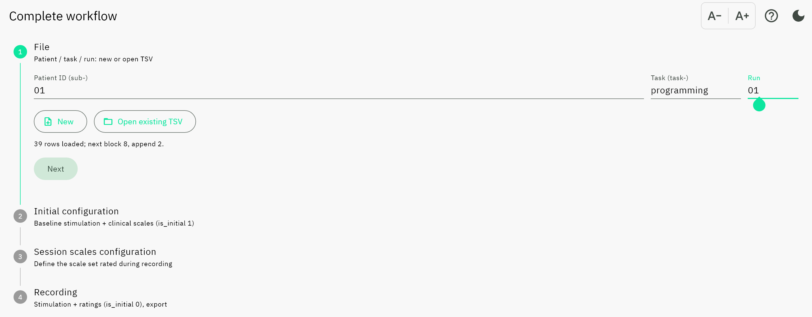
         reporting 39 rows loaded
   :width: 100%

   The File step, with an existing session opened.

Enter the **patient ID**, the **task** and the **run number**, then choose where
to save. The task is ``programming`` unless you name another; whatever you type
becomes the ``task-`` part of the :doc:`BIDS filename <../output_format>` and
the ``TaskName`` in its sidecar, so a study that labels its tasks differently can
keep its own scheme. Like every BIDS label it keeps letters and digits only.

**New** asks whether this visit is a loose TSV or goes straight into a BIDS
dataset.

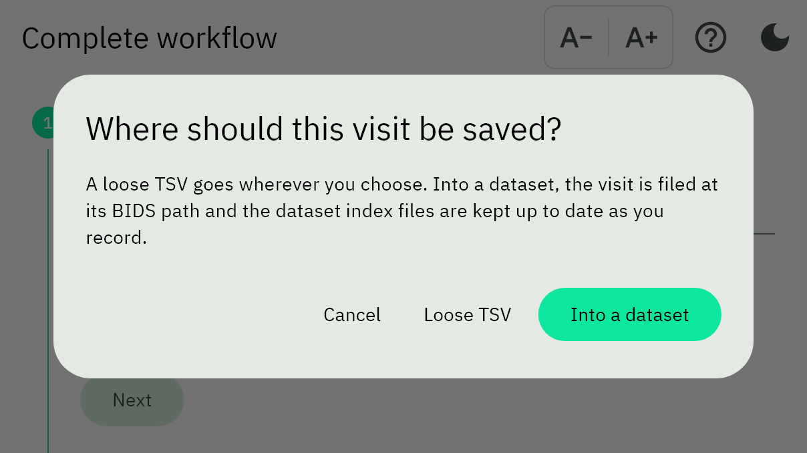

**A loose TSV** goes wherever you choose. The app composes the
:doc:`BIDS filename <../output_format>` and creates the file straight away,
along with its ``.json`` sidecar, so every later insert has somewhere to go.

**Into a dataset** asks for the dataset folder, which must be a BIDS dataset or
an empty folder to start one in (see
:ref:`what counts as a BIDS dataset <bids-folder-requirements>`). If the folder
you picked is neither, **Choose another folder** opens the picker again. It then
asks for the session label, proposed as today's date but editable:
``ses-YYYYMMDD`` is this app's convention, and plenty of studies use
``ses-preop`` or ``ses-3mo``. As you type, the dialog shows the label as it will
be filed (``3-mo`` becomes ``3mo``).

A dataset can hold any number of recordings per participant and session:
several ``ses-preop`` visits, programming and notes side by side. The one thing
two files cannot share is the whole name, participant, session, task and run
together, because the second would replace the first on disk. So when the name
this visit would get is already in the dataset, the dialog says so and the visit
is filed under the next free run instead (``run-02``, ``run-03``), and the
**Run** field changes to match. Nothing is refused and nothing is overwritten.
The label you choose is also the one used when you export this visit. The visit is
filed at its BIDS path when the **first block is inserted**, not when the file
is created: a dataset holding a header-only TSV that no ``scans.tsv`` lists is
one that does not validate, and before the first block there is nothing to file.
From then on every insert rewrites it in place, and the dataset index files stay
consistent. It goes through the same rules as
:ref:`adding to a dataset <dataset-merge-rules>`, so your
``dataset_description.json`` and ``participants.tsv`` columns (the dataset's
own description and participant list) are safe. This option is
available on Windows, macOS and Linux. On iPadOS and Android, which do not let an
app write into a folder you pick, the choice still appears with **Into a
dataset** greyed out and the reason beneath it: record a loose TSV, then add it
to a dataset later from :doc:`Reports <reports>`.

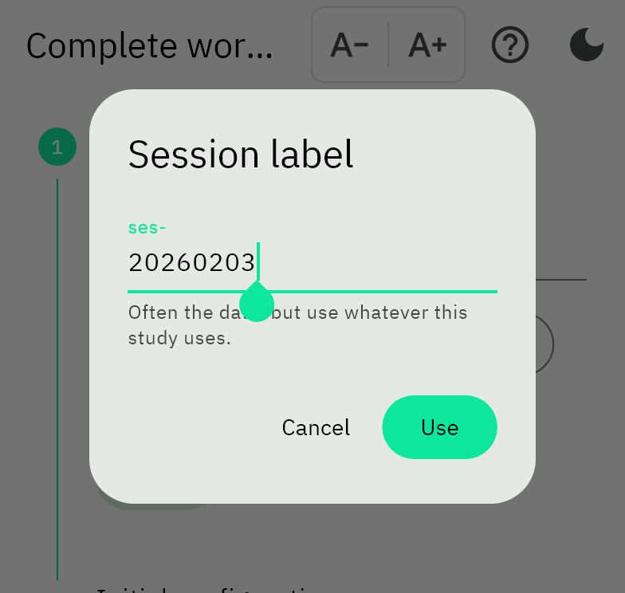

Before recording starts, a dialog shows the dataset folder and the exact path
the visit will be filed under, such as
``sub-01/ses-20260203/beh/sub-01_ses-20260203_task-programming_run-01_beh.tsv``,
with the rule for what is added: the file and its sidecar, a row in
``participants.tsv`` and one in that session's ``scans.tsv``.

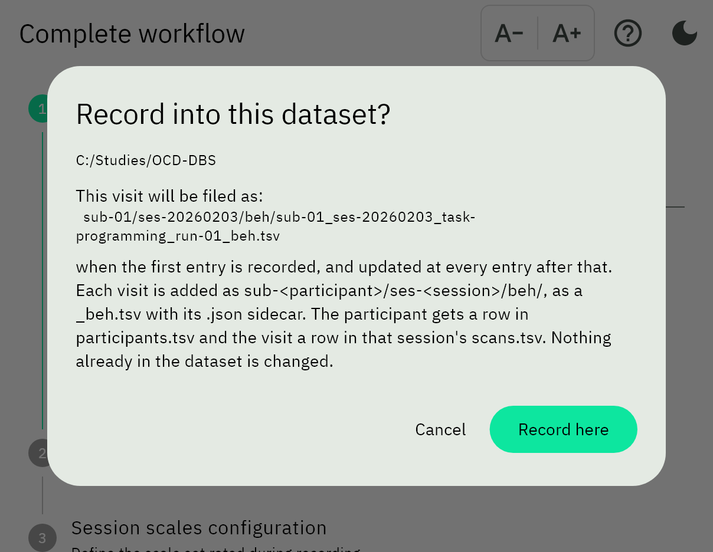

Whichever you choose, **every entry is also written to a working copy inside the
app** as you record, so a crash or a closed window loses nothing. When you leave
the workflow, or close the app window on Windows, macOS or Linux, the app asks
whether to **keep** that copy or **discard** it. Kept, it is offered back the next
time you open this workflow; discarded, it is gone and nothing is offered. It is
never deleted without that answer: after a crash, or when a tablet or phone app is
swiped away, the copy is always kept.

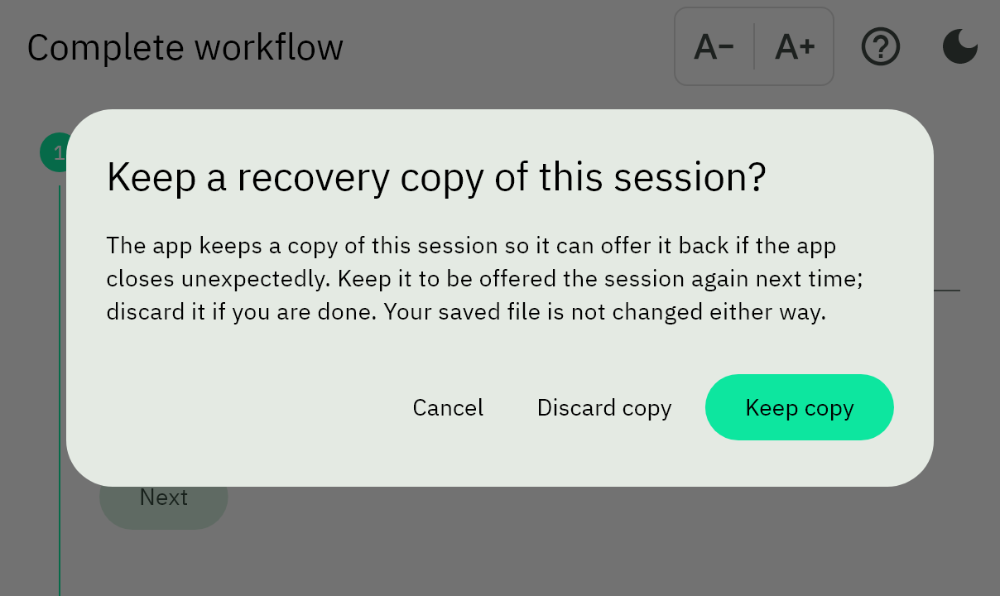

   Asked when you leave the workflow or close the window.

When a copy was kept, the next time you open the workflow it is offered back:

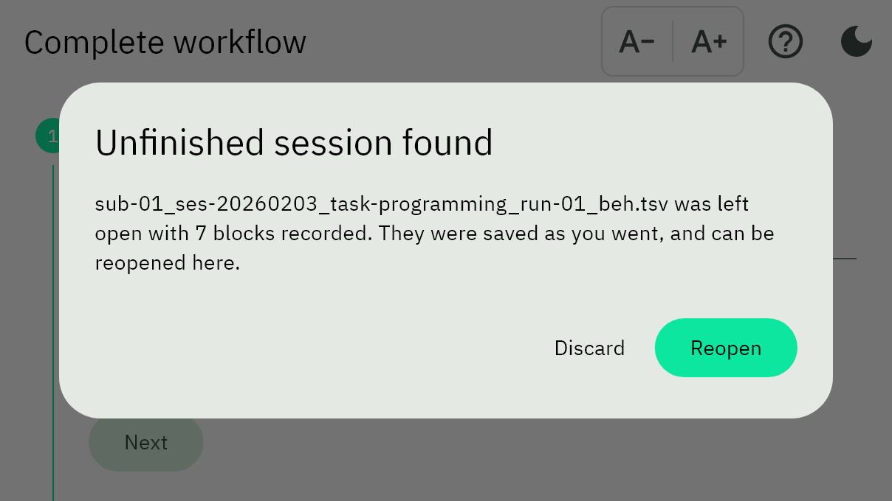

   Reopen continues the session; Discard deletes the copy. Closing the dialog any other way keeps it for next time.

**Open existing TSV** loads a session recorded earlier, and appends to it. The
status line under the buttons reports what was found: the row count, the next
block number, and the append number (``append_id`` in the file: how many times
it has been reopened to add blocks), so an append is never a guess. Opening a
file also adopts the **electrode model named in that file**, so the lead diagrams
show the patient's actual hardware rather than whatever the dropdown last held.
If the file names a model that is not in the catalogue, the app says so rather
than drawing the wrong lead.

A file that is not a programming session, an annotations file for instance, is
refused with an explanation rather than loading as empty rows.

Step 2: Initial configuration
-----------------------------

The state the patient arrived in, before anything is changed.

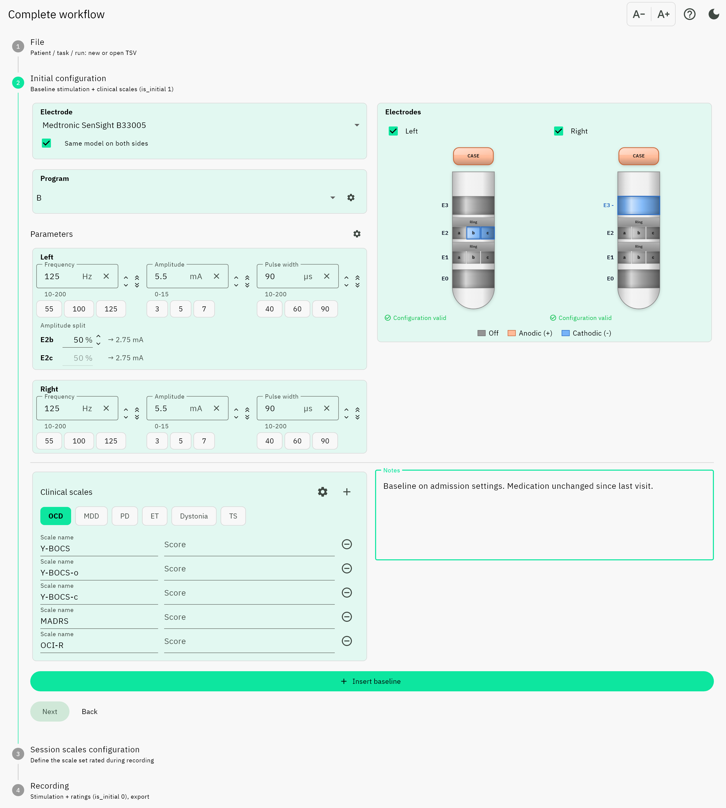
         and amplitude split on the left, lead diagrams on the right, clinical
         scales and notes below
   :width: 100%

   Step 2 with a baseline configuration entered: current steered across two
   segments of level 2 on the left lead, and the OCD clinical scale set.

**Electrode model.** Choose the implanted lead. The catalogue covers Medtronic,
Boston Scientific, Abbott, PINS and ALEVA leads, including segmented
(directional) models. The diagrams are drawn to each lead's real contact heights
and spacings, so two different leads look different.

**Parameters, per side.** Frequency, amplitude and pulse width, with quick-pick
presets. When more than one cathode is active, an amplitude split appears so you
can set the percentage per contact. Those are the ``E2b`` and ``E2c`` rows in
the screenshot above, each showing the milliamps its share works out to.

**Clinical scales.** The baseline assessment: disease-specific scores such as
Y-BOCS or UPDRS-III. Disease presets fill the list in with a tap.

**Notes.** Free text. Unlike the recording step, these persist after inserting,
so you can keep refining the baseline description.

Inserting records this as the **baseline block** (``is_initial = 1``).

Several cards have a gear that edits the choices they offer. These are
**presets**: they apply to every future session and live in the app's own
preferences, never in a session file, so editing one changes nothing already
recorded. The dialogs below are the ones you meet in this step.

.. _dialog-programs:

Programs
~~~~~~~~

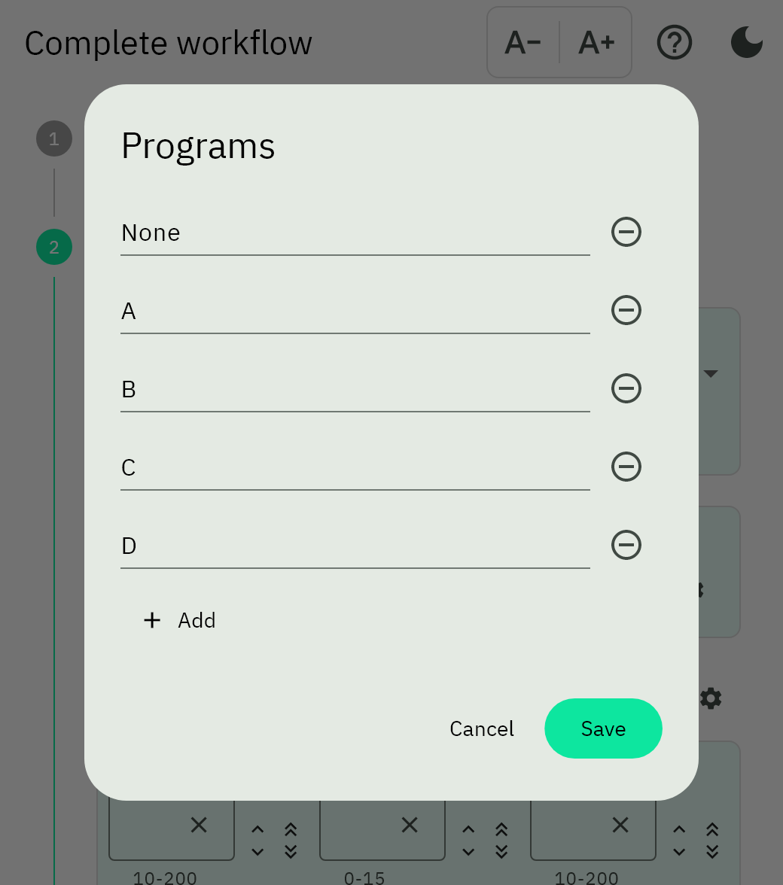

Opened by the gear beside the **Program** card in steps 2 and 4.

The program labels offered by the dropdown: ``A``, ``B``, ``C``
and so on, or whatever your centre uses. Stored as a preset, so the list you
build is there next session.

.. _dialog-parameter-presets:

Parameter presets
~~~~~~~~~~~~~~~~~

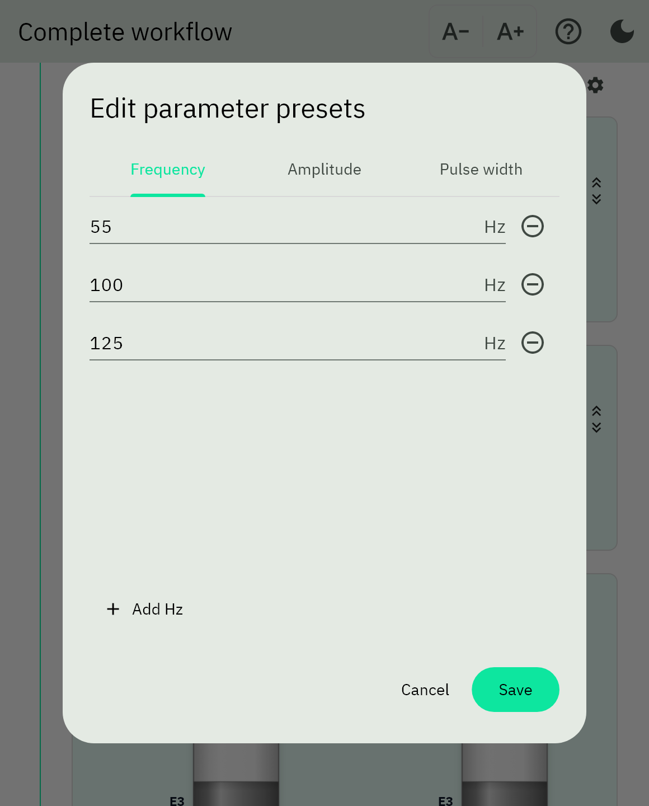
         Pulse width
   :width: 40%
   :align: center

Opened by the gear beside **Parameters** in steps 2 and 4.

The quick-pick chips under each stimulation field, one tab per parameter. These
are shortcuts, not limits: each field accepts any value within the permitted
range for that parameter, whether or not it is in this list.

A value that is not a number, or that falls outside the permitted range, is
refused with the reason shown in the dialog rather than being silently dropped.

.. _dialog-clinical-scales:

Clinical scales settings
~~~~~~~~~~~~~~~~~~~~~~~~

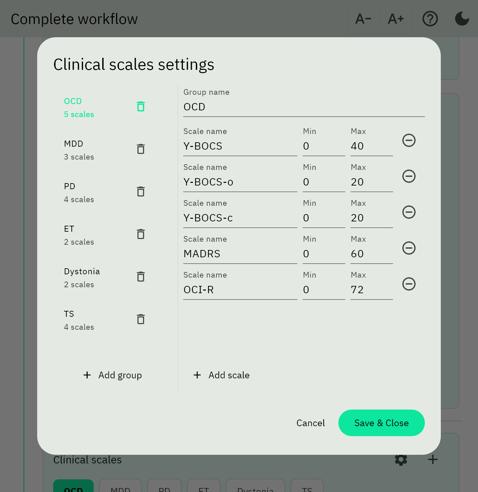
         selected group's scale names on the right
   :width: 50%
   :align: center

Opened by the gear on the **Clinical scales** card in step 2.

Edits the disease preset buttons for the baseline assessment: the group names
(OCD, MDD, PD, ET, Dystonia, TS) and the scale names inside each. A clinical
scale is just a name and a score, so a row here is one field.

Selecting contacts
~~~~~~~~~~~~~~~~~~

Tap a contact to cycle it from off, to anode, to cathode, and back to off. Tap
the case to use it as the return. Segmented levels show their three segments
plus a *Ring* strip that activates the whole level at once.

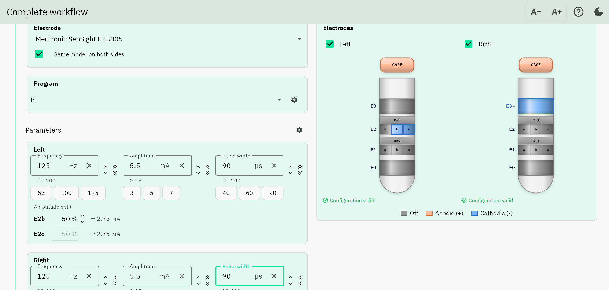
         "Configuration valid" in green, above the polarity key
   :width: 100%

   A valid configuration: two segments of level 2 as cathodes on the left, a
   ring contact on the right, the case as the return on both.

Invalid combinations are applied anyway and flagged as you build them, so you can
work through a configuration in whatever order suits you rather than having edits
rejected mid-way:

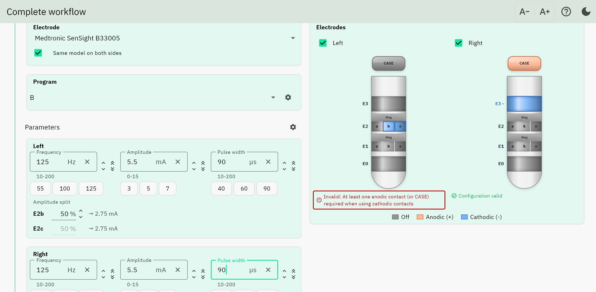
         return path
   :width: 100%

   The same cathodes with no return path selected. The change is kept; the pane
   says why it will not stimulate.

Narrow screens
~~~~~~~~~~~~~~

Below about 900 logical pixels (a phone, or a tablet held in portrait) the two
rows stack into one column. Everything is present; there is simply more
scrolling.

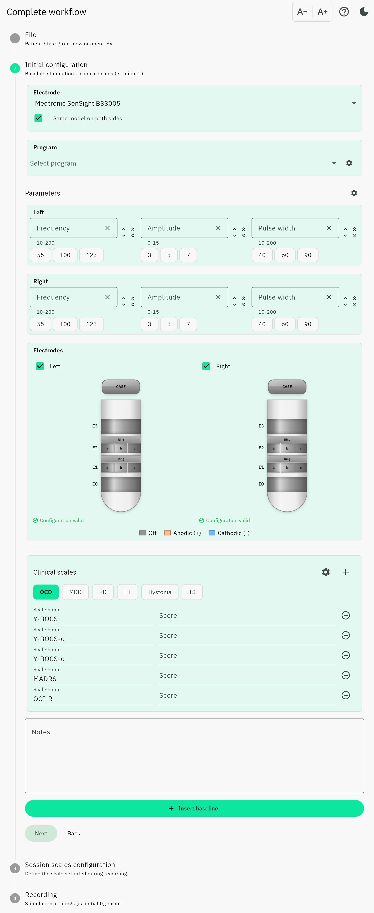

   Step 2 in the single-column layout.

Step 3: Session scales configuration
------------------------------------

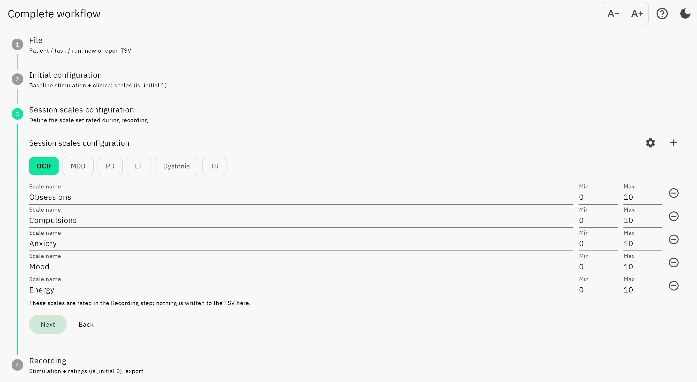
         scale with a name, minimum and maximum
   :width: 100%

   The scale set that will be rated at every configuration.

Name the scales to be rated at *every* configuration, with a minimum and maximum
for each. Keeping the set fixed for the whole session is what makes the ratings
comparable between configurations.

Choosing a disease preset here, or having chosen one in step 2, fills the list.
The gear icon edits :ref:`the presets themselves <dialog-session-scales>`, which
persist between sessions. Nothing on this step is written to the file; it defines
what step 4 will ask for.

.. _dialog-session-scales:

Session scales settings
~~~~~~~~~~~~~~~~~~~~~~~

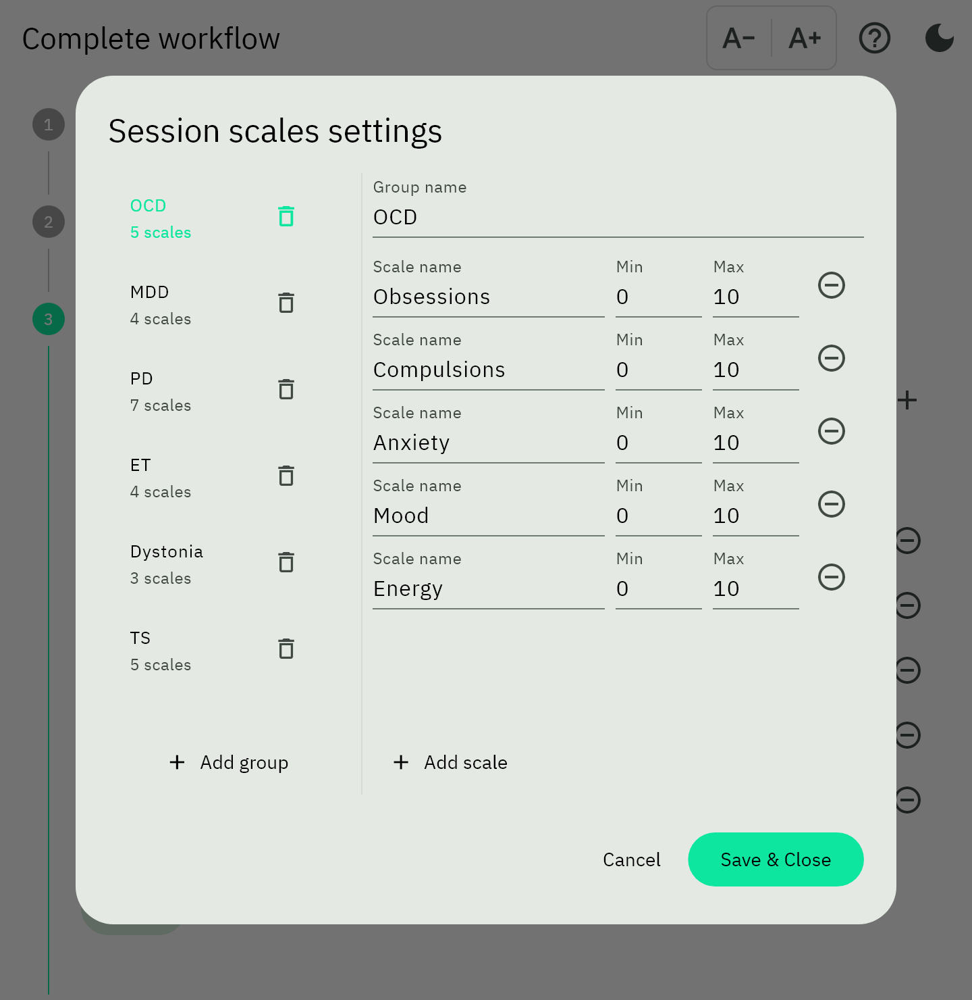
         maximum as well as a name
   :width: 50%
   :align: center

Opened by the gear on **Session scales configuration** in step 3.

The same shape as the clinical dialog, with one difference: each row here also
carries a **minimum and maximum**. Session scales are rated on a slider at every
configuration, so they need a range; clinical scales are typed once, so they do
not.

Step 4: Recording
-----------------

The loop, repeated once per configuration tried.

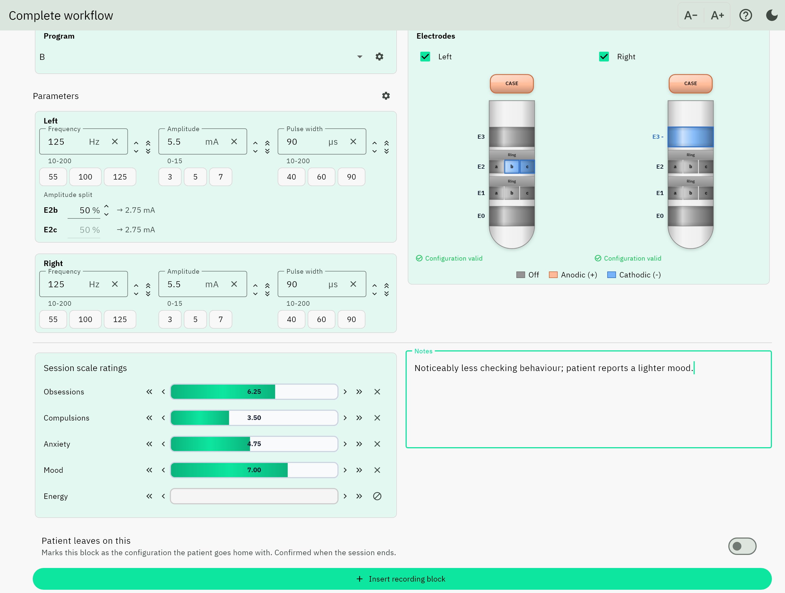
         ratings, side effects and notes below, with the Insert button
   :width: 100%

   One configuration rated and ready to insert. *Energy* is marked not assessed.

Set the parameters and contacts as in step 2, then rate each scale. A scale that
was not assessed can be marked omitted, which writes ``n/a`` rather than a
made-up number. That is the grey bar with the crossed-out icon in the
screenshot above.

**Side effects** have their own field, separate from notes, because a side effect
is the tolerability record for that configuration and should not be buried in
free text.

Insert to record the block. Notes and side effects clear, ready for the next one;
the parameters stay, so a single amplitude change is one edit rather than a full
re-entry.

The same step in the dark theme:

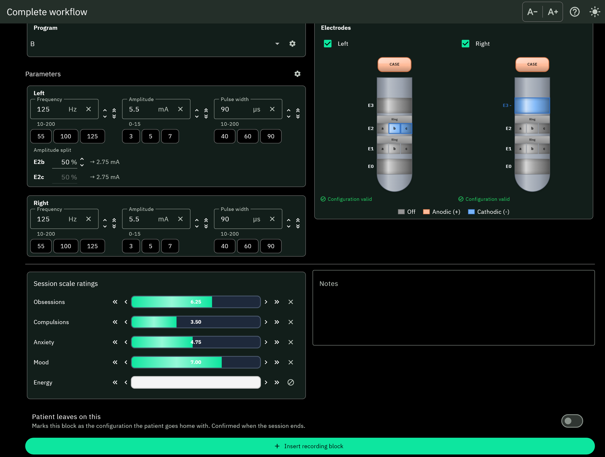

   Dark theme. The contact polarity colours are deliberately identical in both
   themes, because they are the safety-relevant part of the drawing.

Reviewing as you go
~~~~~~~~~~~~~~~~~~~

Below the entry area, everything inserted so far is shown two ways.

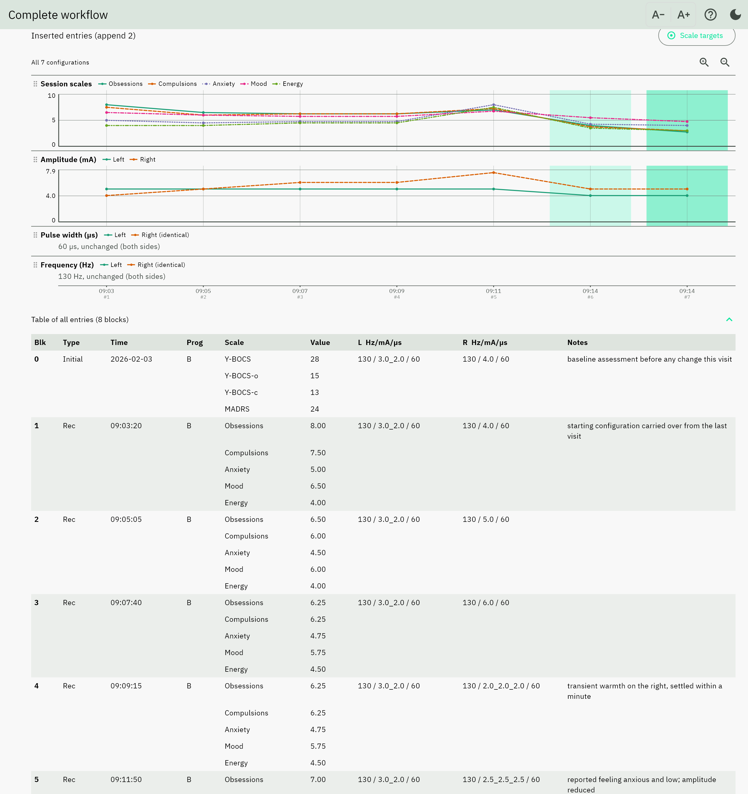
         pulse width and frequency, with a series key
   :width: 100%

   **Four charts** sharing one time axis: session scales, amplitude, pulse width
   and frequency.

The panels are aligned vertically, so a dip in a scale can be read against the
amplitude that preceded it. They scroll horizontally, showing the most recent
configurations by default, with zoom controls and drag handles to reorder the
panels.

**A table** of every entry sits below them, grouped by block. Values that belong
to the block (time, program, parameters) are printed once rather than
repeated on every scale row, and a heavy rule marks each block boundary.

**Scale targets** sets what "better" means per scale (minimise, maximise, or
closest to a value). Once set, the best- and second-best-scoring configurations
are shaded green across all four charts. Until set, nothing is ranked; see
:ref:`scale-targets`.

.. _dialog-scale-targets:

Scale targets
~~~~~~~~~~~~~

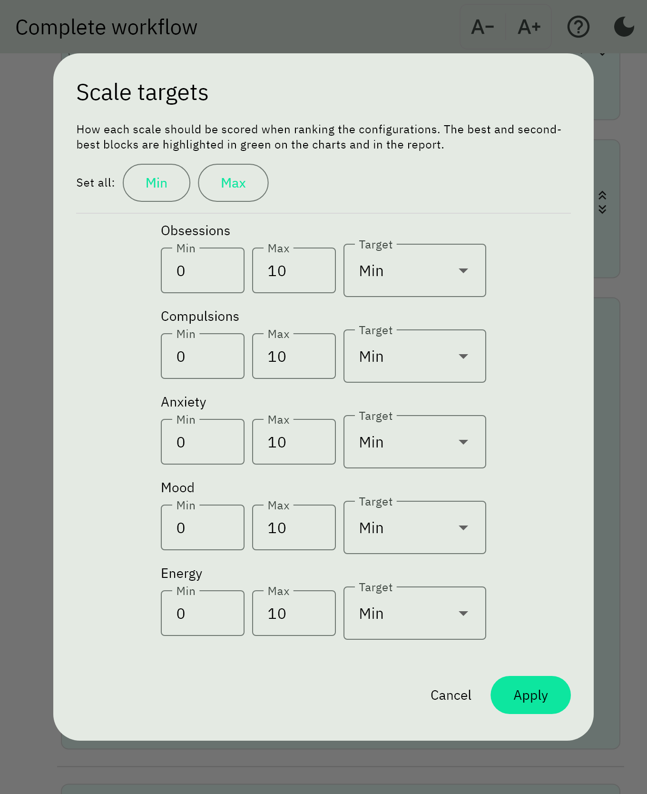
         a target mode
   :width: 47%
   :align: center

Opened by **Scale targets** in step 4, on the Reports and datasets screen, or from
the report sections dialog.

Says what "better" means for each scale, which is the input the ranking needs and
the one thing only you can supply. **Set all: Min / Max** fills the column in one
tap for a set of scales that all run the same way.

Each scale gets a mode: ``Min``, ``Max``, ``Custom`` (closest to a stated value,
which reveals a *Value* field), or ``Ignore``. Until targets are set, no
configuration is ranked anywhere: see :ref:`scale-targets` for the definition of
the aggregate index and :ref:`what-the-reports-do-not-say` for its limits.

Exporting
---------

**Export** offers a PDF or Word report, the raw TSV, or the whole session as a
:ref:`BIDS dataset <bids-dataset-export>`. Paper size applies to both document
formats and is remembered between exports.

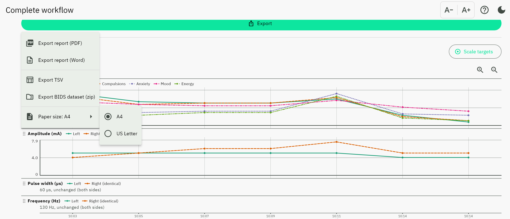
         BIDS dataset, with the paper-size submenu showing A4 selected
   :width: 100%

   The Export menu, with the paper-size submenu open.

Choosing a report opens the report sections dialog first. See
:doc:`../reports` for what each section contains.

.. _dialog-report-sections:

Report sections
~~~~~~~~~~~~~~~

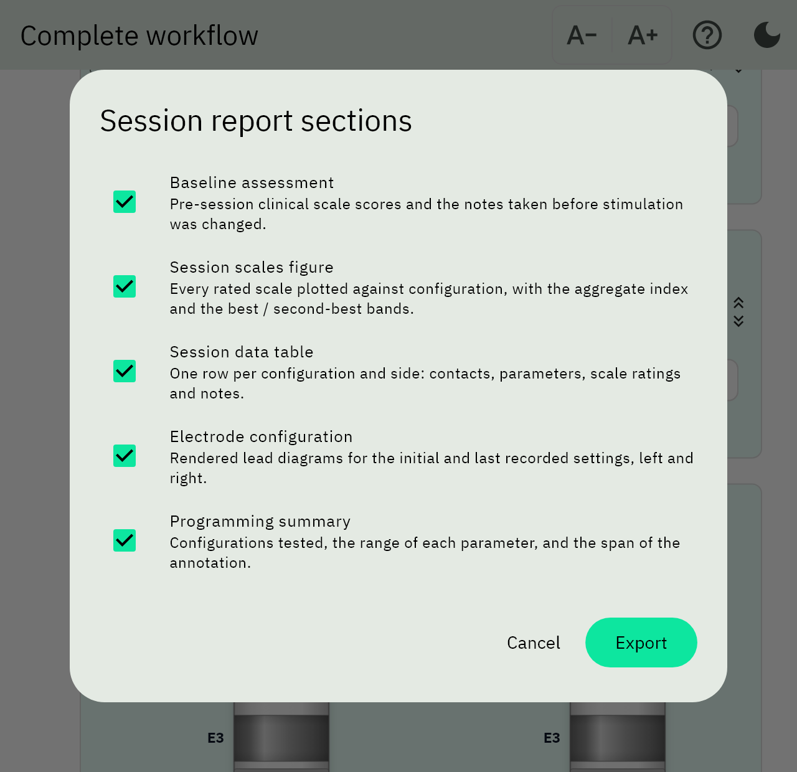
         section
   :width: 44%
   :align: center

Appears when you export a report, before the save dialog. Each report kind has
its own list, and the dialog title says which one you are choosing for:

* **Session report sections**: baseline, session scales figure, session data
  table, electrode configuration and programming summary.
* **Longitudinal report sections**: clinical scales by visit, visits table,
  session scales by visit and block, combined session data table, electrode
  configuration, programming summary and source files. The session data table,
  the electrodes and the programming summary start unticked, because they are
  the sections that add pages; tick them to include them.

Each section has a one-line description of what it adds. **Export** is disabled
while nothing is checked, because a report of a title page alone is not a
document anyone wants. **Scale targets…** opens the dialog above without losing
the selection, since the ranking those targets drive is what several of these
sections show.

The selection is remembered for the next export, separately for each report
kind.
