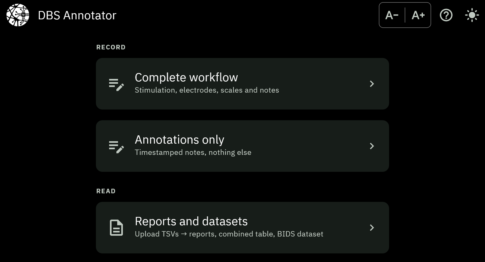
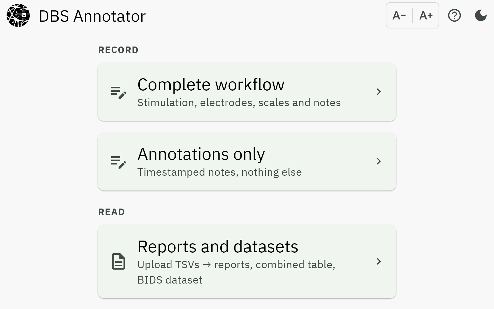

Home
====

The launcher. Four entries in two groups, and the three controls that appear in
the top bar of every screen.

.. figure:: ../_static/screenshots/home.png
   :alt: Home screen with four entries grouped under Record and Reports
   :width: 100%

   **Record** is for a session happening now; **Reports** is for a file that
   already exists.

.. list-table::
   :header-rows: 1
   :widths: 26 74

   * - Entry
     - Use it when
   * - :doc:`Complete workflow <complete_workflow>`
     - You are running a programming session: stimulation parameters, electrode
       contacts, scale ratings, side effects and notes.
   * - :doc:`Annotations only <annotations>`
     - You only want timestamped notes, with no stimulation data.
   * - :doc:`Reports and datasets <reports>`
     - You have one or more TSVs and want reports, a combined table or a BIDS
       dataset, with no authoring.

The first two *create* data. The last only *reads* it, so it is safe to open
against a file you care about.

The top bar
-----------

Present on every screen, at the same place, because both of these matter during
an appointment and neither should need hunting for.

**Theme.** The moon / sun control switches between light and dark.

   Dark theme, for a dimly lit consulting room.

**Text size.** The **A- / A+** pill scales all text between 0.8× and 1.6×.

   Enlarged text. Layouts reflow rather than clipping, on every screen.

**Help.** The **?** opens the About dialog: the version, the licence and where
to report a problem. See :ref:`dialog-about`.
