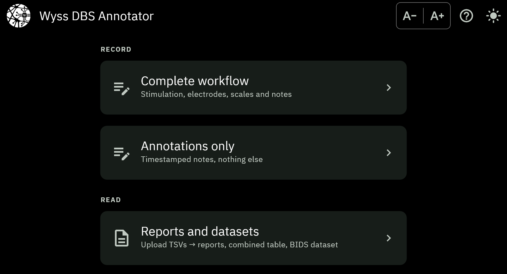
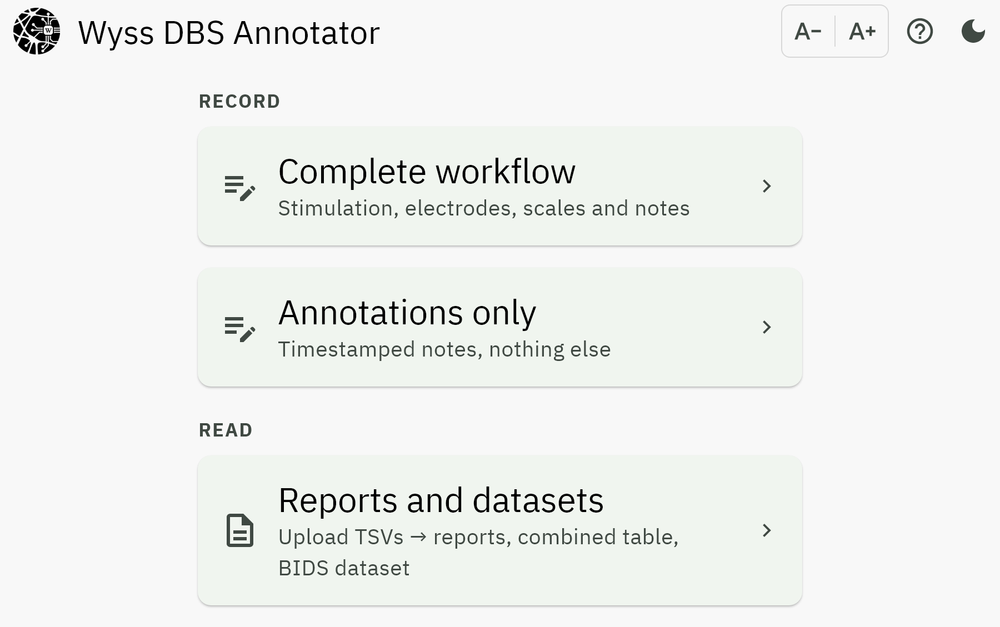
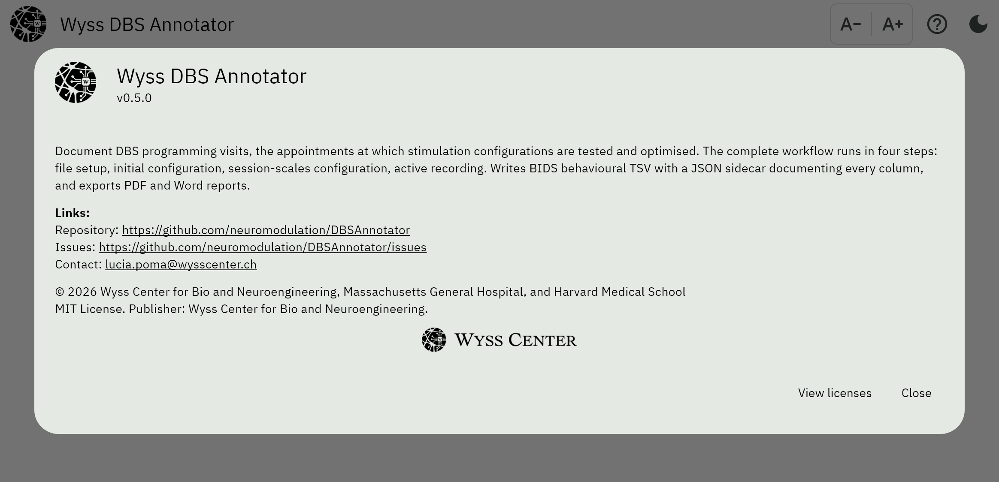

Home
====

The launcher. Three entries in two groups, and the controls that appear in the
top bar of every screen.

.. figure:: ../_static/screenshots/home.png
   :alt: Home screen with three entries grouped under Record and Read
   :width: 100%

   **Record** is for a session happening now; **Read** is for files that already
   exist.

.. list-table::
   :header-rows: 1
   :widths: 26 74

   * - Entry
     - Use it when
   * - :doc:`Complete workflow <complete_workflow>`
     - You are running a programming session: stimulation parameters, electrode
       contacts, scale ratings and notes.
   * - :doc:`Annotations only <annotations>`
     - You only want timestamped notes, with no stimulation data.
   * - :doc:`Reports and datasets <reports>`
     - You have one or more TSVs and want reports, a combined table or a BIDS
       dataset, with no authoring.

The first two *create* data. The last only *reads* it, so it is safe to open
against a file you care about.

The top bar
-----------

Present on every screen, in the same place: theme, text size and help.

**Theme.** The moon / sun control switches between light and dark.

   Dark theme, for a dimly lit consulting room.

**Text size.** The **A- / A+** pill scales all text between 0.8× and 1.6×.

   Enlarged text. Layouts reflow rather than clipping, on every screen.

**Help.** The **?** opens the About dialog: the version, the licence and where
to report a problem.

.. _dialog-about:

Help / about
~~~~~~~~~~~~

         contact links
   :width: 81%
   :align: center

Opened by the **?** in the top bar of every screen.

The version, the licence, and where to report a problem. The version here is the
one stamped into every report footer, so it is what to quote in a bug report.
Links are selectable text rather than buttons: the app opens no browser, because
it makes no outbound connections at all. See :doc:`../privacy`.
