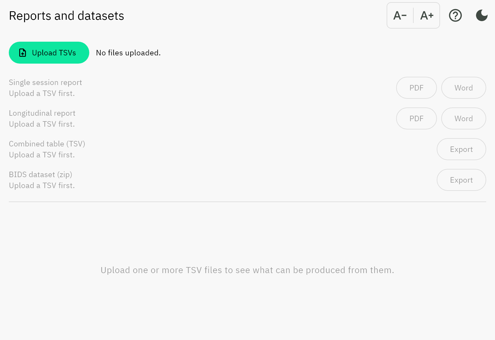
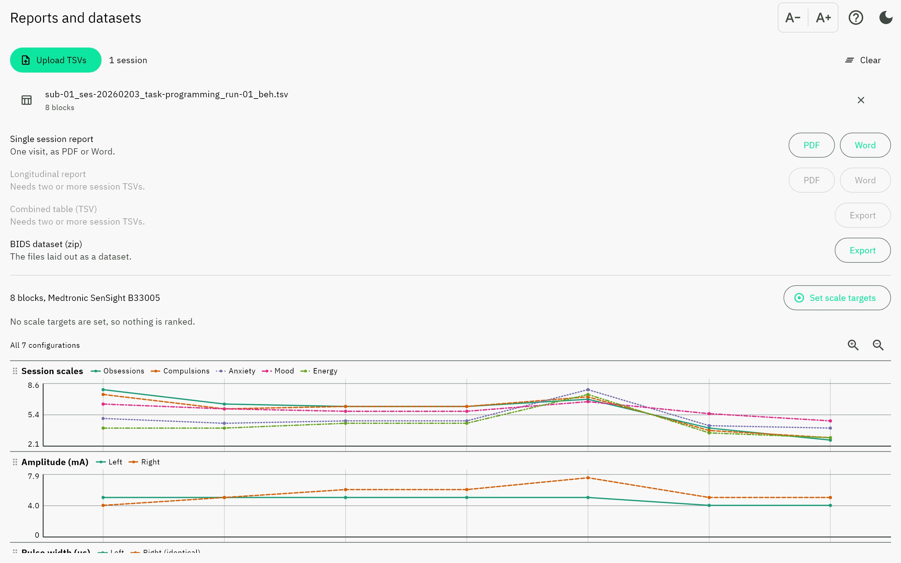
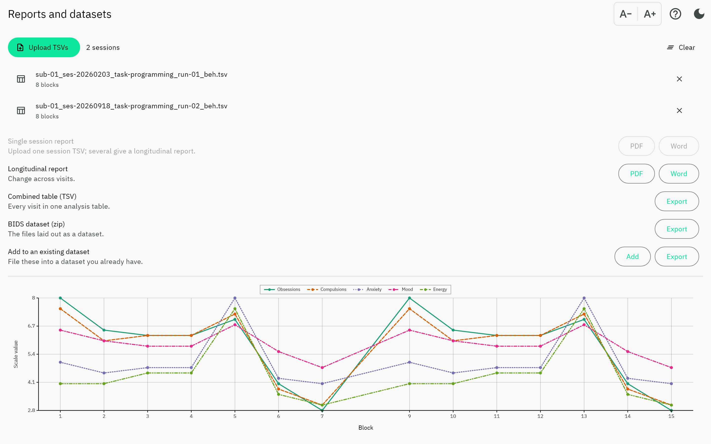
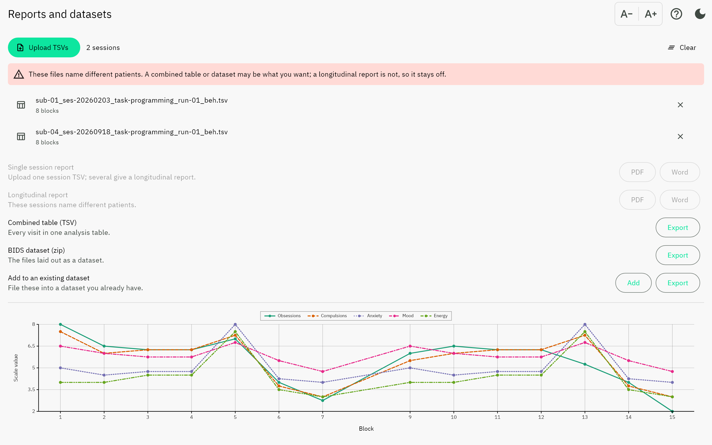

Reports and datasets
====================

Upload the TSVs you have, then take whatever they support. This screen writes
nothing to the files you give it: it reads them, shows what is in them, and
produces documents and datasets from them.

It replaces the two report screens the app used to have. Which of those you
needed depended on how many files you had, so the choice came before the
information needed to make it.

         every action listed and disabled
   :width: 100%

   Before anything is uploaded. Every action is listed, disabled, with the
   reason underneath rather than hidden until you tap it.

Uploading
---------

**Upload TSVs** takes several files at once. Each is classified by its
**columns**, not its name, so a file renamed by hand still opens as what it is,
and a file that is neither a programming session nor a notes file is rejected by
name rather than loaded as a screen of blank rows.

A file already in the list is refused by name. Two files with the same basename
would collide in a BIDS dataset and would be double-counted in a combined table,
so the duplicate is dropped rather than silently merged.

What each upload enables
------------------------

.. list-table::
   :header-rows: 1
   :widths: 34 66

   * - Action
     - Available when
   * - Single session report
     - Exactly one session TSV, or notes on their own
   * - Longitudinal report
     - Two or more sessions **naming the same patient**
   * - Combined table (TSV)
     - Two or more session TSVs
   * - BIDS dataset (zip)
     - At least one file whose name carries a ``sub-`` entity

An action that is unavailable is greyed out **and says why**, in place of its
description. A control that accepts the tap and then refuses in a snackbar makes
you discover the rule one failure at a time.

         available, the longitudinal report and combined table are not
   :width: 100%

   One session. The report and a dataset are available; the longitudinal report
   and the combined table need more than one visit.

Several visits of one patient
-----------------------------

With two or more sessions naming the same patient, every action is available and
the preview becomes the scales timeline across all of them.

Different patients
------------------

If the uploaded files name more than one patient, the screen says so and the
longitudinal report stays off. Combining two people into one longitudinal report
is a safety problem, not a formatting one. A combined table and a BIDS dataset
across several patients are ordinary things to want, so those stay available.

         disabled with its reason
   :width: 100%

Exporting
---------

Reports offer **PDF** or **Word**. Both report kinds show the
:ref:`report sections <dialog-report-sections>` dialog first, with
:ref:`scale targets <dialog-scale-targets>` reachable from inside it. For a
notes file every section applies, so the dialog is skipped.

The longitudinal chooser offers seven sections. Two of them are worth knowing
about before you tick them:

* **Electrode configuration** draws four lead diagrams per visit, so six visits
  is roughly a page and a half of images. It is off by default, as on the
  desktop.
* **Session data** prints every configuration of every visit, grouped under a
  per-visit subheading rather than given a visit column: the session table's
  twelve widths are sized to their own headings, and a thirteenth broke them
  mid-word.

Scale targets do two things here, both **within** each visit. They band the
best-scoring block of each visit in the session-scales figure, and they fix the
y axis to the declared range instead of fitting it to the data, so a scale sits
on the same axis at every visit and a drop between visits is a drop rather than
a rescale. They deliberately do **not** rank visits against each other: the
aggregate index is normalised within a session, so values from different visits
were never on one scale. The clinical figure carries no bands for the same
reason, and says so in its caption.

A TSV records nothing about the targets used when its own report was made, so
the longitudinal export asks for them again.

A report is named from its source file's own BIDS entities with the data suffix
replaced by ``_report``, so the two sort together in a directory listing:

.. code-block:: text

   sub-01_ses-20260203_task-programming_run-01_beh.tsv
   sub-01_ses-20260203_task-programming_run-01_report.pdf

A file whose name carries no ``sub-`` entity keeps its own stem rather than
having one invented for it: a wrong subject label on a clinical document is
worse than an unhelpful filename.

The longitudinal report spans visits, so it carries no ``ses-`` and no
``task-``; ``desc-`` is the BIDS entity for naming what a computed file is:

.. code-block:: text

   sub-01_desc-longitudinal_report.pdf

See :doc:`../reports` for what each document contains, and
:ref:`the combined table <combined-table>` for what the aggregated TSV holds.
