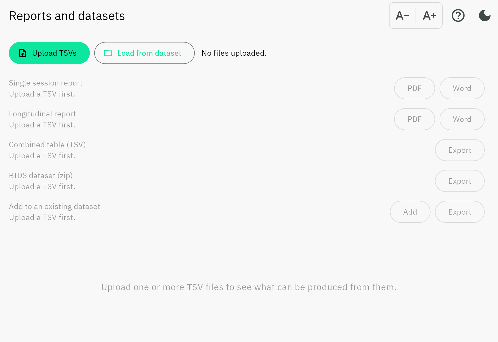
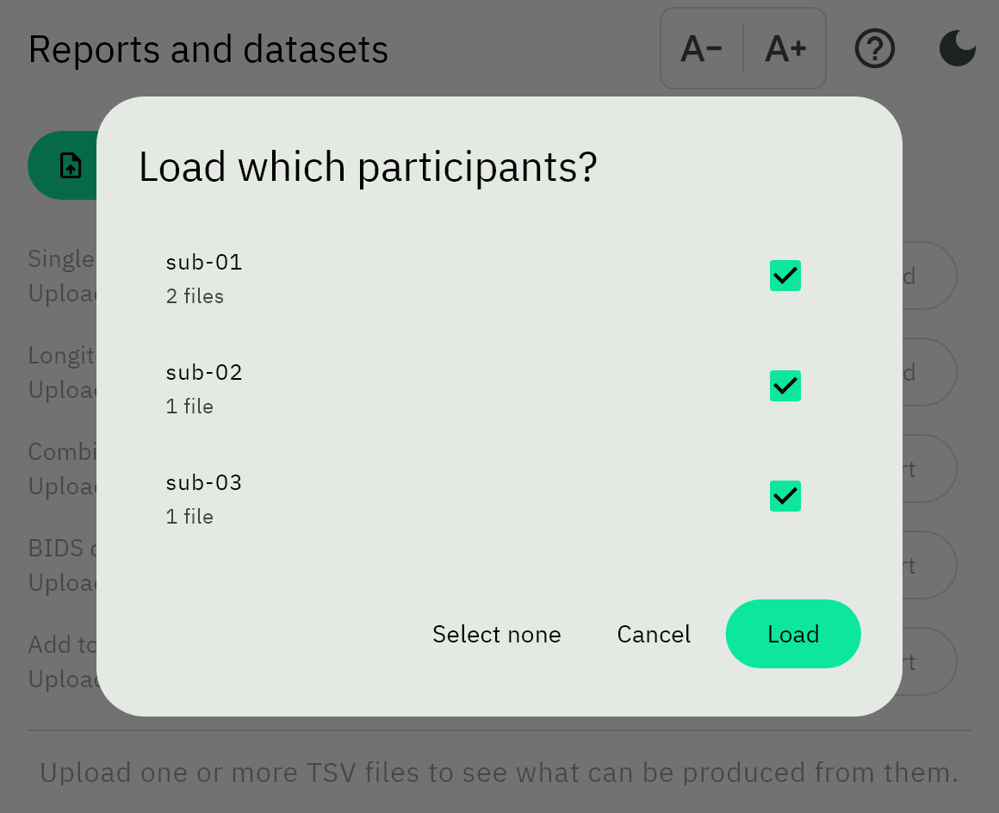
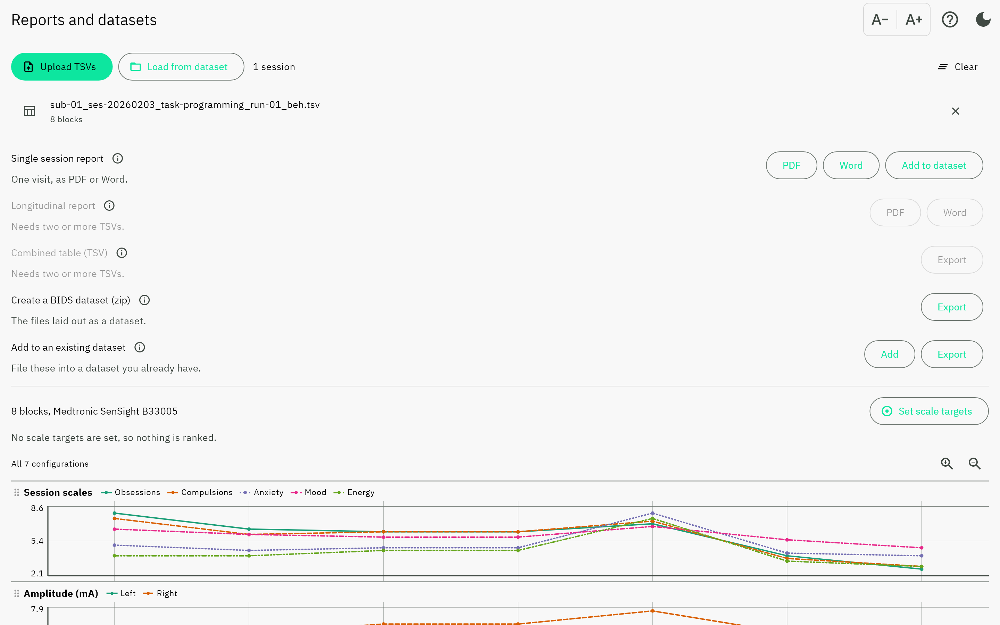
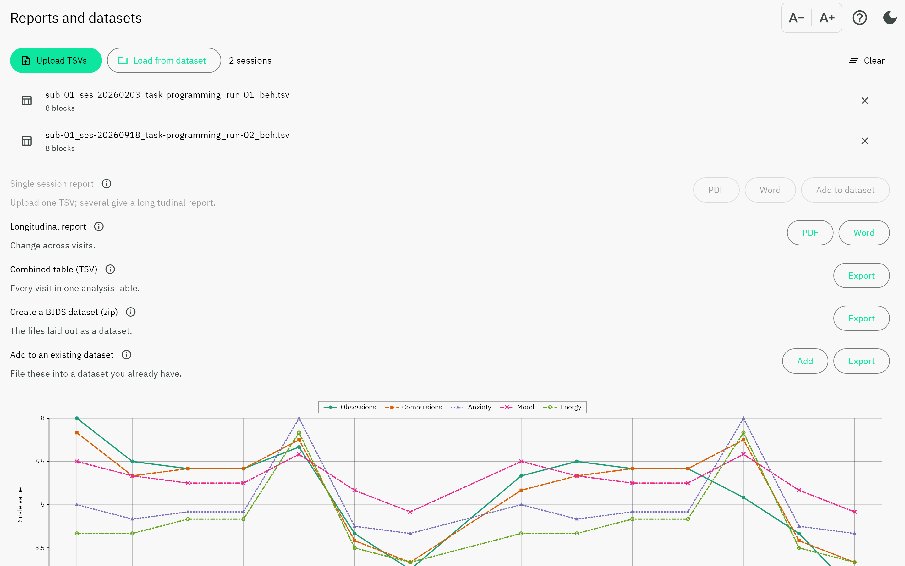
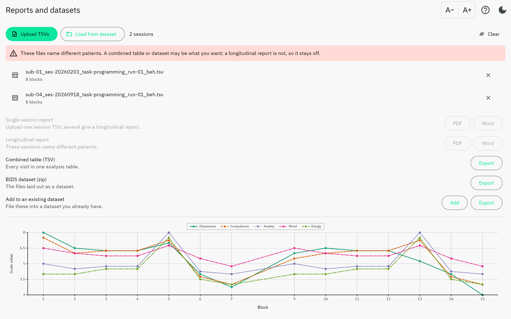
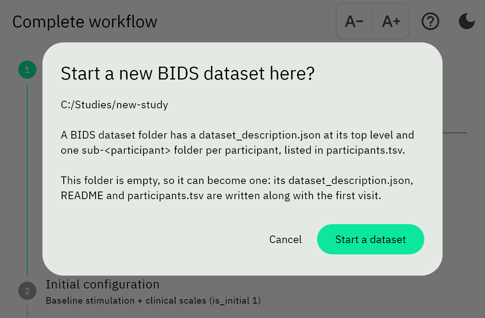
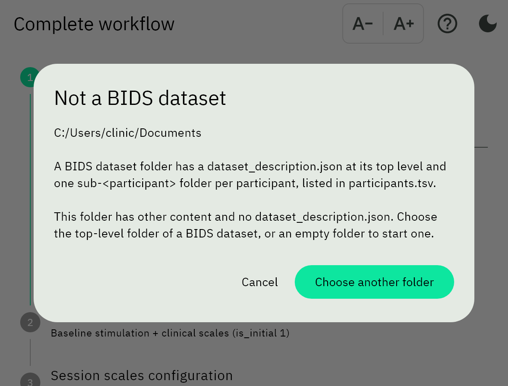
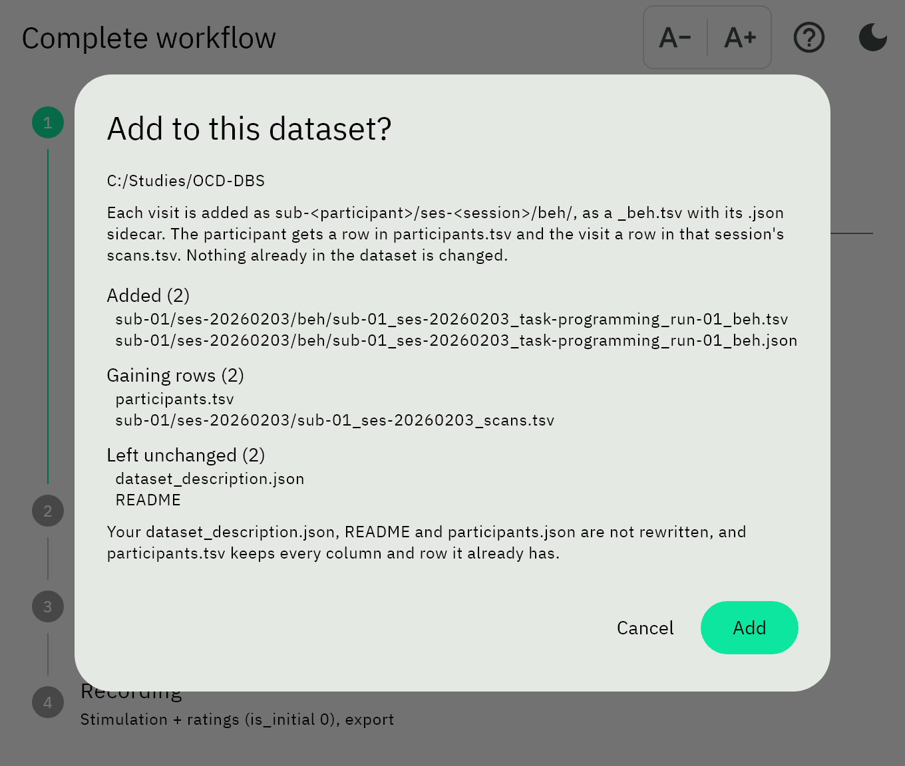
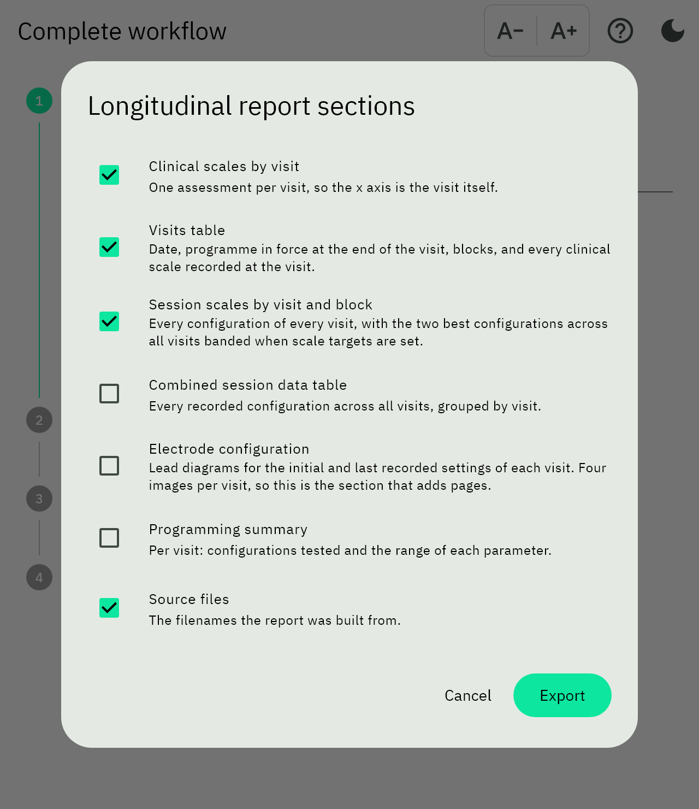

Reports and datasets
====================

Upload the TSVs you have, or load them from a BIDS dataset, then take whatever
they support. This screen never changes the files you give it: it reads them,
shows what is in them, and produces documents and datasets from them. The one
thing it writes into a dataset is the combined table, under ``derivatives/``.

.. raw:: html

   <video controls muted playsinline preload="metadata" width="100%"
          poster="../_static/videos/reports.png">
     <source src="../_static/videos/reports.mp4" type="video/mp4">
   </video>

From the home screen: two visits uploaded, the longitudinal report's sections
chosen, the scale targets it ranks by, then the export.

         every action listed and disabled
   :width: 100%

   Before anything is uploaded. Every action is listed, disabled, with the
   reason underneath rather than hidden until you tap it.

Uploading
---------

**Upload TSVs** takes several files at once. Each is classified by its
**columns**, not its name, so a file renamed by hand still opens as what it is,
and a file that is neither a programming session nor a notes file is rejected by
name rather than loaded as a screen of blank rows.

A file already in the list is refused by name. Two files with the same basename
would collide in a BIDS dataset and would be double-counted in a combined table,
so the duplicate is dropped rather than silently merged.

.. _load-from-dataset:

Loading from a dataset
----------------------

When your visits are already filed in a BIDS dataset, **Load from dataset** reads
them from there instead of one upload at a time. On Windows, macOS and Linux you
choose the dataset folder; on iPadOS and Android you choose the dataset as a
``.zip``, because those systems do not let an app read a folder you pick.

Every session and notes TSV under ``sub-<participant>/ses-<session>/beh/`` is
found, including older ``_events.tsv`` files. Sidecars, imaging, other datatypes
and everything under ``derivatives/`` are left alone. A checklist then shows each
participant with the number of files found, all ticked: untick the ones you do
not want, for example to keep a longitudinal report to one patient.

         the number of files for each
   :width: 42%
   :align: center

The chosen
files join the list exactly as if you had uploaded them, so every action below
works the same way, and a single file can still be removed.

What each upload enables
------------------------

.. list-table::
   :header-rows: 1
   :widths: 34 66

   * - Action
     - Available when
   * - Single session report
     - Exactly one session TSV, or notes on their own
   * - Longitudinal report
     - Two or more sessions **naming the same patient**
   * - Combined table (TSV)
     - Two or more session TSVs
   * - BIDS dataset (zip)
     - At least one file whose name carries a ``sub-`` entity
   * - Add to an existing dataset
     - As above

An action that is unavailable is greyed out **and says why**, in place of its
description.

         available, the longitudinal report and combined table are not
   :width: 100%

   One session. The report and a dataset are available; the longitudinal report
   and the combined table need more than one visit.

Several visits of one patient
-----------------------------

With two or more sessions naming the same patient, every action is available and
the preview becomes the scales timeline across all of them.

Different patients
------------------

If the uploaded files name more than one patient, the screen says so and the
longitudinal report stays off. Combining two people into one longitudinal report
is a safety problem, not a formatting one. A combined table and a BIDS dataset
across several patients are ordinary things to want, so those stay available.

         disabled with its reason
   :width: 100%

Notes alongside a session
-------------------------

Upload a ``task-notes`` file together with the session it belongs to and each
note appears in the session data table, placed by its own clock time, with only
the Time and Notes cells filled.

It gets its own row rather than being written into a block's Notes cell,
because a note carries no configuration: attaching it to one would assert it was
recorded against stimulation settings the file never says it was. A note with no
readable timestamp is left out, since there is nowhere on a time axis to put it.

Adding to a dataset you already have
------------------------------------

**Add to an existing dataset** folds the uploaded files into a BIDS dataset you
already have, rather than producing a separate one to reconcile by hand. It
offers both ways of doing that, so the choice is yours:

* **Add** writes into the folder you choose. Available on Windows, macOS and
  Linux; iPadOS and Android do not let an app write into a folder you pick, so
  the button is disabled there and says why.
* **Export** takes the dataset as a zip and gives a merged zip back, leaving the
  original untouched. Available everywhere, and the safe way to see what a merge
  produces before letting it near the real thing.

.. _bids-folder-requirements:

**What counts as a BIDS dataset.** The folder (or the top level of the zip) must
hold a ``dataset_description.json``, with one ``sub-<participant>`` folder per
participant listed in ``participants.tsv``. If the folder you pick is empty, the
app offers to start a new dataset there, writing its
``dataset_description.json``, ``README`` and ``participants.tsv`` along with the
first visit. A folder with other content and no ``dataset_description.json`` is
refused, with this explanation, so BIDS files are never scattered through a
folder that is not a dataset.

   An empty folder: the app offers to start a dataset there.

   A folder with other content and no dataset_description.json.

**How a visit is added.** Each visit goes to
``sub-<participant>/ses-<session>/beh/`` as a ``_beh.tsv`` with its ``.json``
sidecar. Its participant gets a row in ``participants.tsv`` and the visit a row in
that session's ``sub-<participant>_ses-<session>_scans.tsv``. Nothing already in
the dataset is changed.

**Nothing is written until you have seen what will happen.** Every Add opens a
dialog that restates how the visit is added and lists every file that will be
added, every index file that will gain rows, everything left unchanged, and
anything refused. This is the only operation in the app that writes to data it
did not create, and it has no undo.

.. _dataset-merge-rules:

The rules it follows, and why each one exists:

.. list-table::
   :header-rows: 1
   :widths: 34 66

   * - Files
     - What happens
   * - ``dataset_description.json``, ``README``, ``participants.json``
     - Written only if missing. Yours carry the study's authors, licence and
       DOI; the app's would replace them with a generated stub.
   * - ``participants.tsv``, ``*_scans.tsv``
     - Unioned, never replaced. Every column you have is kept, so ``age``,
       ``sex`` or ``diagnosis`` survive, and a new subject is appended with
       those cells empty.
   * - ``sub-*/ses-*/beh/*``
     - Added only. A path that already exists is **refused and named**, because
       overwriting it would replace recorded clinical data.
   * - Everything else
     - Untouched. Other datatypes, derivatives and anything you keep alongside
       are never even read.

Merging the same files twice does nothing the second time.

A zip merge is refused above 200 MB, since a dataset carrying imaging does not
fit in an iPad's or Android device's memory. Adding into a folder on Windows,
macOS or Linux has no such limit.

Exporting
---------

Reports offer **PDF** or **Word**. Both report kinds show the
:ref:`report sections <dialog-report-sections>` dialog first, with
:ref:`scale targets <dialog-scale-targets>` reachable from inside it. For a
notes file every section applies, so the dialog is skipped.

The longitudinal chooser offers seven sections. Three of them start unticked,
because they add pages:

* **Combined session data table** prints every configuration of every visit,
  one table per visit under its own heading.
* **Electrode configuration** draws four lead diagrams per visit, so six visits
  is roughly a page and a half of images.
* **Programming summary** gives the parameters used at each visit.

Scale targets do two things here. They mark the two best configurations
across **all** visits together, banded in the session-scales figure and shaded in
the per-visit tables, and they fix the y axis to the declared range instead of
fitting it to the data, so a scale sits on the same axis at every visit and a
drop between visits is a drop rather than a rescale. The ranking is meaningful
across visits because every visit's index is computed against the same targets
and declared ranges. The clinical figure carries no bands.

A TSV does not store scale targets, so the longitudinal export asks for them.

A report is named from its source file's own BIDS entities with the data suffix
replaced by ``_report``, so the two sort together in a directory listing:

.. code-block:: text

   sub-01_ses-20260203_task-programming_run-01_beh.tsv
   sub-01_ses-20260203_task-programming_run-01_report.pdf

A file whose name carries no ``sub-`` entity keeps its own stem rather than
having one invented for it: a wrong subject label on a clinical document is
worse than an unhelpful filename.

The longitudinal report spans visits, so it carries no ``ses-`` and no
``task-``; ``desc-`` is the BIDS entity for naming what a computed file is:

.. code-block:: text

   sub-01_desc-longitudinal_report.pdf

See :doc:`../reports` for what each document contains, and
:ref:`the combined table <combined-table>` for what the aggregated TSV holds.

The combined table
------------------

The combined table always comes with its ``.json`` sidecar, which documents the
four key columns and every session column, so the table can be read without this
documentation at hand.

When every session in the list was :ref:`loaded from a dataset folder
<load-from-dataset>`, **Export** saves the table into that dataset first, where
BIDS puts a table that spans sessions:

.. code-block:: text

   derivatives/dbs-annotator-aggregate/
       dataset_description.json
       desc-aggregate_beh.tsv
       desc-aggregate_beh.json

The folder's ``dataset_description.json`` marks it as a derivative and names the
app that produced it; it is written once and never replaced. The table itself is
regenerated from the raw files, so exporting again replaces it, and the previous
version is kept beside it with a ``.bak-`` suffix. Nothing in the raw
``sub-*`` tree is written. The app then asks whether to save a copy somewhere
else too, as a ``.zip`` holding the table and its sidecar.

If the list mixes files from the dataset with files uploaded from elsewhere, or
the dataset was loaded as a ``.zip``, nothing is written into the dataset and the
table and sidecar are exported as a ``.zip`` as usual.
